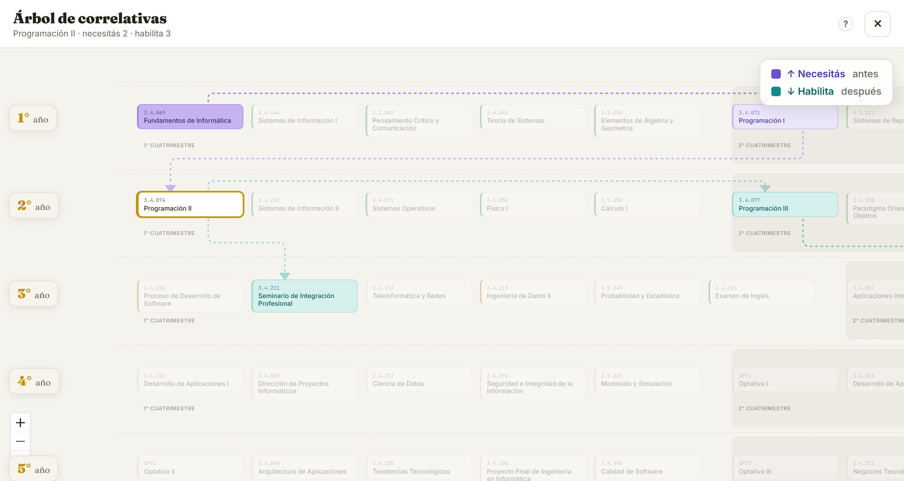

  

<h1 align="center">¿Cuánto me falta?</h1>

  <b>Seguí el avance de tu carrera de un vistazo.</b> 
  Marcá tus materias, mirá las correlativas y sabé cuánto te falta para recibirte.

  <a href="https://cuantomefalta.app">▶ <b>Probala en cuantomefalta.app</b></a>

  

## Qué podés hacer

- 🎓 **Elegí tu carrera** — Ingeniería en Informática, Lic. en Gestión de Tecnología de la Información, Tecnicatura en Desarrollo de Software o Lic. en IA y Ciencia de Datos (y se vienen más).
- ✅ **Marcá cada materia** — pendiente, cursando, pendiente de final o aprobada.
- 🌳 **Mirá el árbol de correlativas** — qué necesitás antes y qué habilita cada materia.
- 📊 **Seguí tu avance** — el % aprobado y cuánto te falta para cada título (Analista, Ingeniero, Técnico…).
- ✏️ **Cargá tus notas** — y mirá tu promedio.
- ☁️ **Sincronizá entre dispositivos** — entrá con Google (opcional) y tu avance te sigue del celu a la compu.
- 📱 **Instalala en el celu** — "agregar a inicio" y la usás como una app más.

Si cursás dos carreras que comparten materias, lo que aprobaste en una figura aprobado en la otra: no la marcás dos veces.

  

  Tocás una materia y ves toda su cadena: lo que <b>necesitás</b> antes (violeta) y lo que <b>habilita</b> después (teal).

## Tus datos son tuyos

Sin cuenta, todo lo que cargás queda **guardado solo en tu dispositivo**. Si querés
sincronizar entre el celu y la compu, podés **entrar con Google**: ahí tu avance se guarda
en tu cuenta, protegido para que **solo vos** puedas verlo. Es siempre opcional, y podés
exportar un backup cuando quieras.

Más detalle en la <a href="https://cuantomefalta.app/privacidad.html">Política de Privacidad</a> y los <a href="https://cuantomefalta.app/terminos.html">Términos</a>.

## Aclaración importante

Es un proyecto **independiente, hecho por una estudiante**. **No tiene afiliación oficial con UADE.**
El plan de estudios y las correlativas se cargaron a mano y pueden tener errores o quedar
desactualizados — ante la duda, verificá siempre con la información oficial de tu facultad.

## Sobre el proyecto

Hecho con 💛 por **Marina Luz Zaragoza**. Nació para Ingeniería en Informática (UADE, Plan 1621),
ya son cuatro carreras y está pensado para crecer a más universidades.

Construido con React, TypeScript y Vite.

## Licencia

© 2026 Marina Luz Zaragoza. **Todos los derechos reservados.** El código se publica solo para
mostrar el proyecto y no puede reutilizarse sin autorización. Ver [LICENSE](LICENSE).
