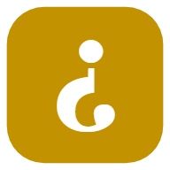
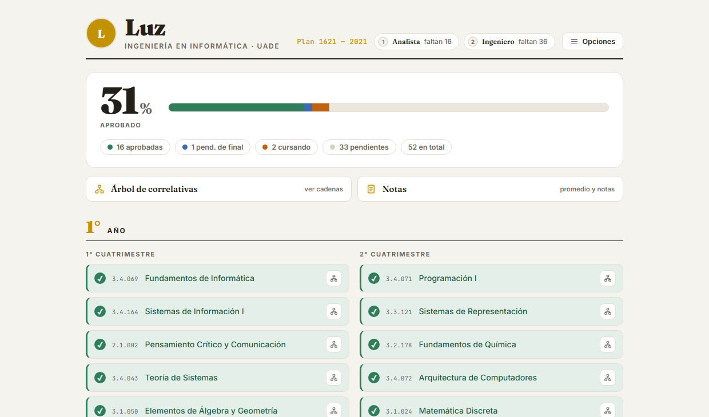

# 1 · Presentación del proyecto

   
  <b>¿Cuánto me falta?</b> 
  <i>Seguí el avance de tu carrera de un vistazo.</i> 
  <a href="https://cuantomefalta.app">cuantomefalta.app</a> · <a href="https://github.com/luzzaragoza/cuanto-me-falta">repositorio</a>

## 1.1 Resumen ejecutivo

**¿Cuánto me falta?** es una aplicación web progresiva (PWA) que permite a estudiantes universitarios registrar el estado de cada materia de su carrera y visualizar, en tiempo real, su avance académico: qué aprobaron, qué están cursando, qué materias tienen disponibles según las correlatividades y cuánto les falta para cada título.

La aplicación nació como herramienta personal para la carrera de Ingeniería en Informática de UADE (Plan 1621) y hoy cubre cuatro carreras de esa universidad, con un modelo de datos pensado para escalar a más planes y universidades. El progreso del usuario se guarda **en su dispositivo** y, si el usuario lo elige, se **sincroniza entre sus dispositivos con su cuenta de Google** — la cuenta es opcional: sin ella, la app funciona completa y nada sale del navegador.

## 1.2 El problema

Para saber "cómo vengo en la carrera", un estudiante hoy tiene que cruzar varias fuentes a mano:

- El **plan de estudios** oficial, un PDF estático que lista materias y correlativas pero no sabe nada de su situación personal.
- El **sistema de gestión académica** de la universidad, que muestra notas históricas pero no responde preguntas como *"¿qué puedo cursar el cuatrimestre que viene?"* o *"¿cuántas materias me faltan para el título intermedio?"*.
- Planillas caseras, capturas y anotaciones que quedan desactualizadas y no entienden el grafo de correlatividades.

El resultado: decisiones de inscripción tomadas con información incompleta, materias "cuello de botella" que se descubren tarde y una sensación general de no saber dónde se está parado.

## 1.3 La solución

Una única pantalla donde el plan de estudios completo es **interactivo**: cada materia tiene un estado (pendiente, cursando, pendiente de final o aprobada) que el estudiante actualiza con dos toques. A partir de ese estado, la aplicación calcula y muestra:

- El **porcentaje de avance** general y por año.
- Los **hitos de título** (por ejemplo, Analista e Ingeniero) y cuántas materias faltan para cada uno.
- Las **materias disponibles** para cursar según las correlatividades.
- Un **aviso inteligente** cuando se marca una materia cuyas correlativas no se cumplen.
- El **árbol de correlativas** completo: para cualquier materia, toda la cadena de lo que *necesita* antes y de lo que *habilita* después.
- El **promedio**, calculado solo sobre materias aprobadas con nota cargada.

## 1.4 Misión

Que cualquier estudiante pueda ver en segundos dónde está parado en su carrera —qué aprobó, qué puede cursar y cuánto le falta para recibirse— sin planillas caseras ni tener que descifrar el plan de estudios a mano.

## 1.5 Visión

Convertirse en la herramienta de referencia para el seguimiento del avance académico universitario, ampliando la cobertura a más carreras y universidades sin resignar los dos principios fundacionales: simplicidad y privacidad.

## 1.6 Valores

- **Claridad ante todo.** La pregunta que da nombre al proyecto se responde de un vistazo, sin menús ni configuración.
- **Privacidad por diseño.** Los datos académicos son del estudiante: viven en su dispositivo y son exportables. La analítica de uso, cuando está activa, es agregada y sin cookies.
- **Honestidad.** Es un proyecto independiente hecho por una estudiante, sin afiliación oficial con UADE, y lo dice de manera explícita; ante cualquier duda, la fuente de verdad es la información oficial de la facultad.
- **Calidad de ingeniería.** Tipado estricto, dominio testeado y un pipeline que no publica nada que no pase los tests.
- **Hecho por estudiantes, para estudiantes.** El tono, el vocabulario (cuatri, final, correlativa) y las decisiones de producto salen de la experiencia real de cursar.

## 1.7 Objetivos

**Objetivo general**

Desarrollar una aplicación web instalable que permita a estudiantes universitarios registrar el estado de sus materias y visualizar su avance académico, respetando el régimen de correlatividades de su plan de estudios y garantizando la privacidad de sus datos.

**Objetivos específicos**

1. Modelar los planes de estudio de forma **normalizada y reutilizable** (universidad → plan → materias, correlativas y títulos), de modo que agregar una carrera sea cargar datos y no escribir código nuevo.
2. Permitir la **gestión del estado** de cada materia entre cuatro estados, con validación informativa de correlativas al momento del cambio.
3. Calcular automáticamente las **métricas de avance**: porcentaje general, conteos por estado, avance por año, promedio y distancia a cada título.
4. Ofrecer **dos vistas de correlatividades** complementarias: la consulta puntual por materia (panel) y el grafo completo (árbol interactivo).
5. Garantizar la **privacidad**: persistencia 100 % local, sin registro de usuarios, con respaldo (backup) portable en formato abierto.
6. Funcionar como **PWA**: instalable en el teléfono y utilizable sin conexión.
7. Asegurar la **calidad** mediante tres niveles de tests automatizados y un pipeline de integración y despliegue continuos con gate de calidad.

## 1.8 Alcance

**Incluye (versión actual)**

- Cuatro planes de estudio de UADE precargados: Ingeniería en Informática (Plan 1621), Licenciatura en Gestión de Tecnología de la Información, Tecnicatura Universitaria en Desarrollo de Software y Licenciatura en Inteligencia Artificial y Ciencia de Datos (Plan 107425), con progreso independiente por carrera.
- Gestión de estados y notas por materia, promedio, avance por año e hitos de título.
- Consulta de correlativas por panel y por árbol interactivo.
- Perfil local (nombre y foto), tutorial de primera visita, resumen imprimible/exportable a PDF y backup en JSON (exportar e importar).
- Instalación como PWA con funcionamiento offline.
- **Cuenta opcional con Google** para sincronizar el avance entre dispositivos (con consentimiento explícito y resolución de conflictos a cargo del usuario); sin cuenta, la app funciona completa y 100 % local.

**Fuera de alcance (por diseño, en esta versión)**

- Registro con email y contraseña (el único proveedor de identidad es Google).
- Servidor propio: la sincronización usa Supabase como backend gestionado; no hay API ni lógica de dominio del lado del servidor.
- Edición de planes y correlativas por parte del usuario final (los planes se cargan curados en el código; el usuario solo renombra sus optativas).
- Aplicaciones nativas (iOS/Android): la distribución móvil es vía PWA.

## 1.9 Público objetivo

- **Primario:** estudiantes de UADE de las cuatro carreras cargadas, en cualquier punto de la cursada.
- **Secundario:** ingresantes que quieren entender la estructura de la carrera y planificar sus primeros cuatrimestres.
- **Futuro:** estudiantes de otras carreras y universidades, a medida que se incorporen nuevos planes.

## 1.10 Ficha técnica

| Aspecto | Detalle |
|---|---|
| Tipo de aplicación | SPA / PWA local-first, con sincronización opcional |
| Stack | React 19 · TypeScript · Vite |
| Visualización de grafos | @xyflow/react (React Flow) con layout propio |
| Persistencia | `localStorage` del navegador, con backup JSON portable · sync opcional vía Supabase (login con Google, RLS) |
| Testing | Vitest (unitario + integridad de datos) · Playwright (end-to-end) |
| CI/CD | GitHub Actions → GitHub Pages, con gate de calidad |
| Dominio | [cuantomefalta.app](https://cuantomefalta.app) |
| Autora | Marina Luz Zaragoza |
| Licencia | © 2026 · Todos los derechos reservados (código publicado con fines demostrativos) |
