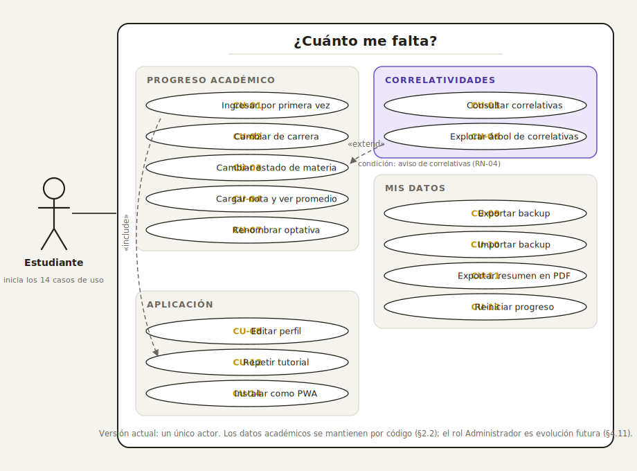

# 3 · Casos de uso

## 3.1 Actores

- **Estudiante:** usuario de la aplicación. Todos los casos de uso de la versión actual le pertenecen (los datos académicos los mantiene la autora por código, ver §2.2).

## 3.2 Diagrama general

## 3.3 Resumen

| ID | Caso de uso | RF relacionados |
|---|---|---|
| CU-01 | Ingresar por primera vez | RF-01, RF-16 |
| CU-02 | Cambiar de carrera | RF-02 |
| CU-03 | Cambiar el estado de una materia | RF-04, RF-05, RF-06 |
| CU-04 | Cargar una nota y consultar el promedio | RF-07, RF-08 |
| CU-05 | Consultar las correlativas de una materia | RF-09 |
| CU-06 | Explorar el árbol de correlativas | RF-10 |
| CU-07 | Renombrar una optativa | RF-12 |
| CU-08 | Editar el perfil | RF-13 |
| CU-09 | Exportar un backup | RF-14 |
| CU-10 | Importar un backup | RF-14 |
| CU-11 | Exportar el resumen en PDF | RF-15 |
| CU-12 | Repetir el tutorial | RF-16 |
| CU-13 | Reiniciar el progreso | RF-17 |
| CU-14 | Instalar la aplicación (PWA) | RF-18 |
| CU-15 | Iniciar sesión y sincronizar | RF-19, RF-20 |
| CU-16 | Cerrar sesión | RF-19 |

## 3.4 Especificación

### CU-01 · Ingresar por primera vez

| Campo | Detalle |
|---|---|
| **Actor** | Estudiante |
| **Precondiciones** | No existe progreso guardado en el dispositivo para el plan por defecto. |
| **Disparador** | El estudiante abre la aplicación por primera vez. |

**Flujo principal**

1. La aplicación detecta que no hay perfil guardado y muestra la pantalla de bienvenida.
2. El estudiante ingresa su nombre.
3. El estudiante elige su carrera entre los planes disponibles.
4. La aplicación crea el espacio de progreso local del plan elegido, guarda el perfil y muestra la pantalla principal con todas las materias en estado *pendiente*.
5. Se ejecuta automáticamente el tutorial de primera visita (coach marks) sobre las funciones principales. *(«include» CU-12)*

**Flujos alternativos**

- **3a.** El estudiante no cambia la carrera propuesta: se usa el plan por defecto (Ingeniería en Informática).

**Postcondiciones**

- Existe un perfil y un espacio de progreso local; el tutorial queda marcado como visto y no vuelve a ejecutarse solo.

---

### CU-02 · Cambiar de carrera

| Campo | Detalle |
|---|---|
| **Actor** | Estudiante |
| **Precondiciones** | El estudiante ya ingresó (CU-01). |
| **Disparador** | El estudiante abre el selector de carrera en el encabezado. |

**Flujo principal**

1. La aplicación muestra la lista de carreras disponibles con la universidad a la que pertenecen.
2. El estudiante elige otra carrera.
3. La aplicación guarda cuál es el plan activo, copia el perfil al plan destino **solo si este aún no tiene uno** (para no volver a preguntar el nombre) y se recarga con el plan elegido.

**Flujos alternativos**

- **2a.** El plan destino ya tenía progreso guardado: se muestra tal cual estaba; nada se pisa.

**Postcondiciones**

- El plan activo cambió. El progreso de cada carrera se conserva por separado (RN-11).

---

### CU-03 · Cambiar el estado de una materia

| Campo | Detalle |
|---|---|
| **Actor** | Estudiante |
| **Precondiciones** | Hay un plan activo con su listado de materias visible. |
| **Disparador** | El estudiante toca el estado de una materia en el plan. |

**Flujo principal**

1. La aplicación abre el selector de estado con las cuatro opciones y su descripción: *Pendiente* ("Todavía no la empecé"), *Cursando* ("La estoy cursando ahora"), *Pendiente de final* ("Aprobé la cursada, me falta rendir") y *Aprobada* ("Final aprobado").
2. El estudiante elige el nuevo estado.
3. La aplicación guarda el cambio de inmediato en el dispositivo.
4. Se recalculan y actualizan en pantalla el porcentaje de avance, los conteos por estado, el avance por año, los hitos de título y las materias disponibles.

**Flujos alternativos**

- **4a. Correlativas incumplidas.** Si la materia no es optativa ni especial y el nuevo estado no cumple RN-02/RN-03, la aplicación muestra un aviso flotante con las materias que faltan (por ejemplo, *"Para cursar Programación II te falta: Programación I"*) y un botón **"Ver árbol de correlativas"** que abre el árbol con foco en esa materia. *(«extend» CU-06)* El cambio de estado **se mantiene** (RN-04).
- **2a.** El estudiante cierra el selector sin elegir: no hay cambios.

**Postcondiciones**

- El estado de la materia quedó persistido y todas las métricas reflejan la nueva situación.

---

### CU-04 · Cargar una nota y consultar el promedio

| Campo | Detalle |
|---|---|
| **Actor** | Estudiante |
| **Precondiciones** | Hay un plan activo. |
| **Disparador** | El estudiante abre el panel de **Notas** desde el tablero. |

**Flujo principal**

1. La aplicación abre el panel lateral de notas y muestra el promedio actual (o su ausencia, si no hay notas).
2. El estudiante ingresa la nota de una materia aprobada.
3. La aplicación valida el valor como entero entre 1 y 10 (ajustando al límite si hace falta, RN-08), lo guarda y recalcula el promedio en el momento (RN-07).
4. El estudiante cierra el panel.

**Flujos alternativos**

- **2a. Borrar una nota:** el estudiante vacía el campo; la nota se elimina y el promedio se recalcula sin ella.
- **1a. Sin notas cargadas:** el promedio no muestra valor; la aplicación no falla (RF-08).

**Postcondiciones**

- Las notas quedaron persistidas; el promedio visible corresponde solo a materias aprobadas con nota.

---

### CU-05 · Consultar las correlativas de una materia

| Campo | Detalle |
|---|---|
| **Actor** | Estudiante |
| **Precondiciones** | Hay un plan activo con materias visibles. |
| **Disparador** | El estudiante abre el panel de correlativas de una materia. |

**Flujo principal**

1. La aplicación despliega, debajo de la materia, su panel de correlativas directas en dos grupos con código de color: **"Necesitás"** (violeta) y **"Habilita"** (teal).
2. El estudiante puede abrir los paneles de otras materias sin cerrar el primero: se admiten múltiples paneles abiertos en simultáneo para comparar.
3. El estudiante cierra los paneles que ya no necesita.

**Flujos alternativos**

- **1a.** La materia no tiene correlativas hacia atrás ni hacia adelante: el panel lo indica.

**Postcondiciones**

- Ninguna: es un caso de uso de consulta, no modifica datos.

---

### CU-06 · Explorar el árbol de correlativas

| Campo | Detalle |
|---|---|
| **Actor** | Estudiante |
| **Precondiciones** | Hay un plan activo. |
| **Disparador** | El estudiante abre el árbol desde el tablero, o desde el aviso de correlativas (CU-03), o desde el panel de una materia. |

**Flujo principal**

1. La aplicación muestra el grafo completo del plan: las materias como nodos organizados por año y las correlativas como aristas.
2. Si el árbol se abrió con foco en una materia, la aplicación resalta toda su cadena: los prerrequisitos recursivos ("necesitás", por niveles: previa directa, previa de la previa, etc.) y los dependientes recursivos ("habilita").
3. El estudiante navega el grafo (desplazamiento y zoom) y puede cambiar el foco tocando otra materia.
4. El estudiante cierra el árbol (botón o tecla Escape) y vuelve al plan.

**Postcondiciones**

- Ninguna: es un caso de uso de consulta.

---

### CU-07 · Renombrar una optativa

**Actor:** Estudiante · **Precondición:** el plan activo tiene materias optativas.

El estudiante edita el nombre de una optativa para reflejar la materia real que eligió ese año (la oferta de optativas se publica anualmente y no forma parte del plan). La aplicación admite hasta 48 caracteres y persiste el nombre; si el estudiante deja el campo vacío, se restaura el nombre genérico del plan (RN-10). El nombre personalizado se usa en toda la aplicación: listado, avisos, árbol y resumen.

---

### CU-08 · Editar el perfil

**Actor:** Estudiante · **Disparador:** tocar el avatar del encabezado.

El estudiante puede cambiar su nombre y cargar una foto de perfil. La foto se procesa y guarda **localmente** (nunca se sube a ningún servidor). Sin foto, el avatar muestra las iniciales del nombre (hasta dos). El perfil pertenece al plan activo; al cambiar de carrera se copia solo si el destino no tenía uno (CU-02).

---

### CU-09 · Exportar un backup

**Actor:** Estudiante · **Disparador:** menú **Opciones → Exportar backup (.json)**.

La aplicación genera un archivo JSON con todo el progreso del plan activo (estados, notas, nombres de optativas, perfil) y dispara su descarga con un nombre derivado del perfil (por ejemplo, `plan-uade-luz.json`). El archivo es legible y portable: sirve como respaldo o para llevar el progreso a otro dispositivo (CU-10).

---

### CU-10 · Importar un backup

**Actor:** Estudiante · **Precondición:** tener un archivo exportado por CU-09. · **Disparador:** menú **Opciones → Importar backup**.

El estudiante elige el archivo; la aplicación lo valida y reemplaza el progreso del plan activo por el del backup, actualizando toda la interfaz.

**Flujo alternativo — archivo inválido:** si el archivo no es un JSON exportado por la aplicación, se informa el error ("No pude leer el archivo…") y el progreso actual queda intacto.

---

### CU-11 · Exportar el resumen en PDF

**Actor:** Estudiante · **Disparador:** menú **Opciones → Exportar resumen (PDF)**.

La aplicación abre el diálogo de impresión del navegador sobre una vista de resumen preparada para papel/PDF: identidad del estudiante, carrera del plan activo, métricas de avance y materias agrupadas por estado. El resumen refleja siempre el plan activo (verificado por test end-to-end).

---

### CU-12 · Repetir el tutorial

**Actor:** Estudiante · **Disparador:** menú **Opciones → Ver tutorial**.

Vuelve a ejecutar el recorrido guiado de primera visita (CU-01, paso 5) sobre las funciones principales de la pantalla.

---

### CU-13 · Reiniciar el progreso

**Actor:** Estudiante · **Disparador:** menú **Opciones → Reiniciar** (acción destacada como peligrosa).

Previa confirmación explícita, la aplicación borra el progreso local del plan activo y vuelve al estado inicial. Es irreversible, salvo que exista un backup (CU-09).

---

### CU-14 · Instalar la aplicación (PWA)

**Actor:** Estudiante · **Precondición:** navegador con soporte de PWA.

Desde el navegador, el estudiante usa "Agregar a pantalla de inicio" (o el aviso de instalación). La aplicación queda instalada con su ícono y nombre, se abre a pantalla completa como una app nativa y funciona sin conexión gracias al service worker.

---

### CU-15 · Iniciar sesión y sincronizar

| Campo | Detalle |
|---|---|
| **Actor** | Estudiante |
| **Precondiciones** | La sincronización está configurada en el sitio publicado. |
| **Disparador** | El estudiante toca **"Entrar con Google"** (en la bienvenida, en su perfil o en el aviso de sincronización). |

**Flujo principal**

1. La aplicación redirige a Google; el estudiante autoriza y vuelve con la sesión iniciada.
2. **Primera vez con esa cuenta:** la aplicación muestra la pantalla de consentimiento —qué datos se van a guardar y los enlaces a los Términos y la Política de Privacidad— y el estudiante acepta. *(El consentimiento se registra y viaja con sus datos: no se vuelve a pedir en otros dispositivos.)*
3. La aplicación compara el avance local con el de la cuenta y resuelve: si la cuenta está vacía, **sube** lo local; si el dispositivo está vacío, **baja** lo de la cuenta; si son iguales, no hace nada. *(Si quedaron cambios locales sin subir —el estudiante editó o borró y recargó antes de que se guardara— lo local es más nuevo y **prevalece**: por ejemplo, un "Reiniciar todo" seguido de recargar no restaura el avance desde la cuenta.)*
4. Desde entonces, cada cambio se sube automáticamente; el estado ("sincronizando", "tu avance se sincroniza") es visible junto a la cuenta en el perfil.

**Flujos alternativos**

- **2a. No acepta el consentimiento:** la sesión se cierra y la aplicación sigue 100 % local; nada se subió.
- **3a. Conflicto:** la memoria local y la nube tienen progreso distinto **y no se puede reconciliar sola** (primera vez de la cuenta en este dispositivo, o la misma materia tocada con valores distintos en ambos lados). La aplicación muestra las dos opciones con el conteo de materias de cada lado y **el estudiante decide** cuál conservar; hasta que no elige, no se sube nada (RN-12). En un dispositivo ya sincronizado no se pregunta: la aplicación recuerda la última sincronización, adopta sola el lado que avanzó y, si avanzaron los dos en materias distintas, **fusiona ambos avances** sin perder nada.
- **4a. Sin conexión:** la aplicación sigue funcionando local; el próximo cambio con conexión reintenta la subida.

**Postcondiciones**

- El avance del estudiante queda asociado a su cuenta y disponible en sus otros dispositivos.

---

### CU-16 · Cerrar sesión

**Actor:** Estudiante · **Disparador:** tocar **"Cerrar sesión"** en el perfil (avatar → editar).

La sesión se cierra; el progreso local queda intacto y la aplicación vuelve al modo 100 % local. Los datos ya sincronizados permanecen en la cuenta para el próximo inicio de sesión.
