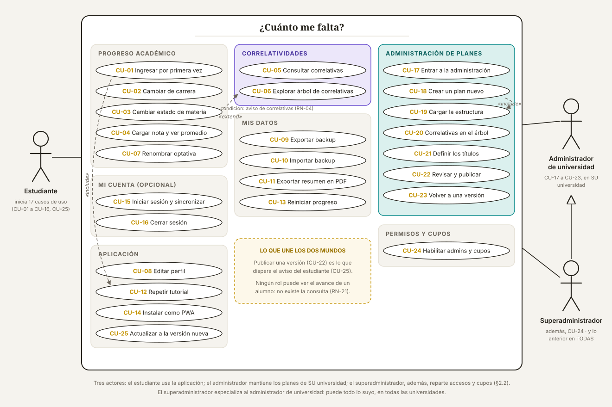

# 3 · Casos de uso

## 3.1 Actores

- **Estudiante:** usuario de la aplicación (CU-01 a CU-16, y CU-25). No necesita cuenta; con una, además sincroniza.
- **Administrador de universidad:** carga y mantiene los planes de su universidad desde `#admin` (CU-17 a CU-23).
- **Superadministrador:** además de lo anterior en cualquier universidad, habilita administradores y fija cupos (CU-24). Ver §2.2.

## 3.2 Diagrama general

## 3.3 Resumen

| ID | Caso de uso | RF relacionados |
|---|---|---|
| CU-01 | Ingresar por primera vez | RF-01, RF-16 |
| CU-02 | Cambiar de carrera | RF-02 |
| CU-03 | Cambiar el estado de una materia | RF-04, RF-05, RF-06, RF-21 |
| CU-04 | Cargar una nota y consultar el promedio | RF-07, RF-08 |
| CU-05 | Consultar las correlativas de una materia | RF-09 |
| CU-06 | Explorar el árbol de correlativas | RF-10 |
| CU-07 | Renombrar una optativa | RF-12 |
| CU-08 | Editar el perfil | RF-13 |
| CU-09 | Exportar un backup | RF-14 |
| CU-10 | Importar un backup | RF-14 |
| CU-11 | Exportar el resumen en PDF | RF-15 |
| CU-12 | Repetir el tutorial | RF-16 |
| CU-13 | Reiniciar el progreso | RF-17 |
| CU-14 | Instalar la aplicación (PWA) | RF-18 |
| CU-15 | Iniciar sesión y sincronizar | RF-19, RF-20 |
| CU-16 | Cerrar sesión | RF-19 |
| CU-17 | Entrar a la administración | RF-23, RF-24, RF-32 |
| CU-18 | Crear un plan nuevo | RF-25 |
| CU-19 | Cargar y corregir la estructura del plan | RF-26 |
| CU-20 | Marcar las correlativas sobre el árbol | RF-27 |
| CU-21 | Definir los títulos del plan | RF-28 |
| CU-22 | Revisar y publicar una versión | RF-29, RF-30 |
| CU-23 | Volver a una versión anterior | RF-30 |
| CU-24 | Habilitar a un administrador y fijar el cupo | RF-31 |
| CU-25 | Actualizar el plan cuando hay una versión nueva | RF-22 |

## 3.4 Especificación

### CU-01 · Ingresar por primera vez

| Campo | Detalle |
|---|---|
| **Actor** | Estudiante |
| **Precondiciones** | No existe progreso guardado en el dispositivo para el plan por defecto. |
| **Disparador** | El estudiante abre la aplicación por primera vez. |

**Flujo principal**

1. La aplicación detecta que no hay perfil guardado y muestra la pantalla de bienvenida.
2. El estudiante ingresa su nombre.
3. El estudiante elige su carrera entre los planes disponibles.
4. La aplicación crea el espacio de progreso local del plan elegido, guarda el perfil y muestra la pantalla principal con todas las materias en estado *pendiente*.
5. Se ejecuta automáticamente el tutorial de primera visita (coach marks) sobre las funciones principales. *(«include» CU-12)*

**Flujos alternativos**

- **3a.** El estudiante no cambia la carrera propuesta: se usa el plan por defecto (Ingeniería en Informática).

**Postcondiciones**

- Existe un perfil y un espacio de progreso local; el tutorial queda marcado como visto y no vuelve a ejecutarse solo.

---

### CU-02 · Cambiar de carrera

| Campo | Detalle |
|---|---|
| **Actor** | Estudiante |
| **Precondiciones** | El estudiante ya ingresó (CU-01). |
| **Disparador** | El estudiante abre el selector de carrera en el encabezado. |

**Flujo principal**

1. La aplicación muestra la lista de carreras disponibles con la universidad a la que pertenecen.
2. El estudiante elige otra carrera.
3. La aplicación guarda cuál es el plan activo, copia el perfil al plan destino **solo si este aún no tiene uno** (para no volver a preguntar el nombre) y se recarga con el plan elegido.

**Flujos alternativos**

- **2a.** El plan destino ya tenía progreso guardado: se muestra tal cual estaba; nada se pisa.

**Postcondiciones**

- El plan activo cambió. El progreso de cada carrera se conserva por separado (RN-11).

---

### CU-03 · Cambiar el estado de una materia

| Campo | Detalle |
|---|---|
| **Actor** | Estudiante |
| **Precondiciones** | Hay un plan activo con su listado de materias visible. |
| **Disparador** | El estudiante toca el estado de una materia en el plan. |

**Flujo principal**

1. La aplicación abre el selector de estado con las cuatro opciones y su descripción: *Pendiente* ("Todavía no la empecé"), *Cursando* ("La estoy cursando ahora"), *Pendiente de final* ("Aprobé la cursada, me falta rendir") y *Aprobada* ("Final aprobado").
2. El estudiante elige el nuevo estado.
3. La aplicación guarda el cambio de inmediato en el dispositivo.
4. Se recalculan y actualizan en pantalla el porcentaje de avance, los conteos por estado, el avance por año, los hitos de título y las materias disponibles.

**Flujos alternativos**

- **4a. Correlativas incumplidas.** Si la materia no es optativa ni especial y el nuevo estado no cumple RN-02/RN-03, la aplicación muestra un aviso flotante con las materias que faltan (por ejemplo, *"Para cursar Programación II te falta: Programación I"*) y un botón **"Ver árbol de correlativas"** que abre el árbol con foco en esa materia. *(«extend» CU-06)* El cambio de estado **se mantiene** (RN-04).
- **2a.** El estudiante cierra el selector sin elegir: no hay cambios.
- **1b. Año completo de una vez.** En vez de tocar materia por materia, el estudiante usa el **interruptor del año** (RF-21): la aplicación marca como *Aprobada* todas las materias de ese año salvo las optativas, en una única operación, y ofrece **deshacer** en el aviso; si el año ya estaba entero aprobado, el interruptor las deja sin marca (RN-15). Sigue en el paso 4.

**Postcondiciones**

- El estado de la materia quedó persistido y todas las métricas reflejan la nueva situación.

---

### CU-04 · Cargar una nota y consultar el promedio

| Campo | Detalle |
|---|---|
| **Actor** | Estudiante |
| **Precondiciones** | Hay un plan activo. |
| **Disparador** | El estudiante abre el panel de **Notas** desde el tablero. |

**Flujo principal**

1. La aplicación abre el panel lateral de notas y muestra el promedio actual (o su ausencia, si no hay notas).
2. El estudiante ingresa la nota de una materia aprobada.
3. La aplicación valida el valor como entero entre 1 y 10 (ajustando al límite si hace falta, RN-08), lo guarda y recalcula el promedio en el momento (RN-07).
4. El estudiante cierra el panel.

**Flujos alternativos**

- **2a. Borrar una nota:** el estudiante vacía el campo; la nota se elimina y el promedio se recalcula sin ella.
- **1a. Sin notas cargadas:** el promedio no muestra valor; la aplicación no falla (RF-08).

**Postcondiciones**

- Las notas quedaron persistidas; el promedio visible corresponde solo a materias aprobadas con nota.

---

### CU-05 · Consultar las correlativas de una materia

| Campo | Detalle |
|---|---|
| **Actor** | Estudiante |
| **Precondiciones** | Hay un plan activo con materias visibles. |
| **Disparador** | El estudiante abre el panel de correlativas de una materia. |

**Flujo principal**

1. La aplicación despliega, debajo de la materia, su panel de correlativas directas en dos grupos con código de color: **"Necesitás"** (violeta) y **"Habilita"** (teal).
2. El estudiante puede abrir los paneles de otras materias sin cerrar el primero: se admiten múltiples paneles abiertos en simultáneo para comparar.
3. El estudiante cierra los paneles que ya no necesita.

**Flujos alternativos**

- **1a.** La materia no tiene correlativas hacia atrás ni hacia adelante: el panel lo indica.

**Postcondiciones**

- Ninguna: es un caso de uso de consulta, no modifica datos.

---

### CU-06 · Explorar el árbol de correlativas

| Campo | Detalle |
|---|---|
| **Actor** | Estudiante |
| **Precondiciones** | Hay un plan activo. |
| **Disparador** | El estudiante abre el árbol desde el tablero, o desde el aviso de correlativas (CU-03), o desde el panel de una materia. |

**Flujo principal**

1. La aplicación muestra el grafo completo del plan: las materias como nodos organizados por año y las correlativas como aristas.
2. Si el árbol se abrió con foco en una materia, la aplicación resalta toda su cadena: los prerrequisitos recursivos ("necesitás", por niveles: previa directa, previa de la previa, etc.) y los dependientes recursivos ("habilita").
3. El estudiante navega el grafo (desplazamiento y zoom) y puede cambiar el foco tocando otra materia.
4. El estudiante cierra el árbol (botón o tecla Escape) y vuelve al plan.

**Postcondiciones**

- Ninguna: es un caso de uso de consulta.

---

### CU-07 · Renombrar una optativa

**Actor:** Estudiante · **Precondición:** el plan activo tiene materias optativas.

El estudiante edita el nombre de una optativa para reflejar la materia real que eligió ese año (la oferta de optativas se publica anualmente y no forma parte del plan). La aplicación admite hasta 48 caracteres y persiste el nombre; si el estudiante deja el campo vacío, se restaura el nombre genérico del plan (RN-10). El nombre personalizado se usa en toda la aplicación: listado, avisos, árbol y resumen.

---

### CU-08 · Editar el perfil

**Actor:** Estudiante · **Disparador:** tocar el avatar del encabezado.

El estudiante puede cambiar su nombre y cargar una foto de perfil. La foto se procesa y guarda **localmente** (nunca se sube a ningún servidor). Sin foto, el avatar muestra las iniciales del nombre (hasta dos). El perfil pertenece al plan activo; al cambiar de carrera se copia solo si el destino no tenía uno (CU-02).

---

### CU-09 · Exportar un backup

**Actor:** Estudiante · **Disparador:** menú **Opciones → Exportar backup (.json)**.

La aplicación genera un archivo JSON con todo el progreso del plan activo (estados, notas, nombres de optativas, perfil) y dispara su descarga con un nombre derivado del perfil (por ejemplo, `plan-uade-luz.json`). El archivo es legible y portable: sirve como respaldo o para llevar el progreso a otro dispositivo (CU-10).

---

### CU-10 · Importar un backup

**Actor:** Estudiante · **Precondición:** tener un archivo exportado por CU-09. · **Disparador:** menú **Opciones → Importar backup**.

El estudiante elige el archivo; la aplicación lo valida y reemplaza el progreso del plan activo por el del backup, actualizando toda la interfaz.

**Flujo alternativo — archivo inválido:** si el archivo no es un JSON exportado por la aplicación, se informa el error ("No pude leer el archivo…") y el progreso actual queda intacto.

---

### CU-11 · Exportar el resumen en PDF

**Actor:** Estudiante · **Disparador:** menú **Opciones → Exportar resumen (PDF)**.

La aplicación abre el diálogo de impresión del navegador sobre una vista de resumen preparada para papel/PDF: identidad del estudiante, carrera del plan activo, métricas de avance y materias agrupadas por estado. El resumen refleja siempre el plan activo (verificado por test end-to-end).

---

### CU-12 · Repetir el tutorial

**Actor:** Estudiante · **Disparador:** menú **Opciones → Ver tutorial**.

Vuelve a ejecutar el recorrido guiado de primera visita (CU-01, paso 5) sobre las funciones principales de la pantalla.

---

### CU-13 · Reiniciar el progreso

**Actor:** Estudiante · **Disparador:** menú **Opciones → Reiniciar** (acción destacada como peligrosa).

Previa confirmación explícita, la aplicación borra el progreso local del plan activo y vuelve al estado inicial. Es irreversible, salvo que exista un backup (CU-09).

---

### CU-14 · Instalar la aplicación (PWA)

**Actor:** Estudiante · **Precondición:** navegador con soporte de PWA.

Desde el navegador, el estudiante usa "Agregar a pantalla de inicio" (o el aviso de instalación). La aplicación queda instalada con su ícono y nombre, se abre a pantalla completa como una app nativa y funciona sin conexión gracias al service worker.

---

### CU-15 · Iniciar sesión y sincronizar

| Campo | Detalle |
|---|---|
| **Actor** | Estudiante |
| **Precondiciones** | La sincronización está configurada en el sitio publicado. |
| **Disparador** | El estudiante toca **"Entrar con Google"** (en la bienvenida, en su perfil o en el aviso de sincronización). |

**Flujo principal**

1. La aplicación redirige a Google; el estudiante autoriza y vuelve con la sesión iniciada.
2. **Primera vez con esa cuenta:** la aplicación muestra la pantalla de consentimiento —qué datos se van a guardar y los enlaces a los Términos y la Política de Privacidad— y el estudiante acepta. *(El consentimiento se registra y viaja con sus datos: no se vuelve a pedir en otros dispositivos.)*
3. La aplicación compara el avance local con el de la cuenta y resuelve: si la cuenta está vacía, **sube** lo local; si el dispositivo está vacío, **baja** lo de la cuenta; si son iguales, no hace nada. *(Si quedaron cambios locales sin subir —el estudiante editó o borró y recargó antes de que se guardara— lo local es más nuevo y **prevalece**: por ejemplo, un "Reiniciar todo" seguido de recargar no restaura el avance desde la cuenta.)*
4. Desde entonces, cada cambio se sube automáticamente; el estado ("sincronizando", "tu avance se sincroniza") es visible junto a la cuenta en el perfil.

**Flujos alternativos**

- **2a. No acepta el consentimiento:** la sesión se cierra y la aplicación sigue 100 % local; nada se subió.
- **3a. Conflicto:** la memoria local y la nube tienen progreso distinto **y no se puede reconciliar sola** (primera vez de la cuenta en este dispositivo, o la misma materia tocada con valores distintos en ambos lados). La aplicación muestra las dos opciones con el conteo de materias de cada lado y **el estudiante decide** cuál conservar; hasta que no elige, no se sube nada (RN-12). En un dispositivo ya sincronizado no se pregunta: la aplicación recuerda la última sincronización, adopta sola el lado que avanzó y, si avanzaron los dos en materias distintas, **fusiona ambos avances** sin perder nada.
- **4a. Sin conexión:** la aplicación sigue funcionando local; el próximo cambio con conexión reintenta la subida.

**Postcondiciones**

- El avance del estudiante queda asociado a su cuenta y disponible en sus otros dispositivos.

---

### CU-16 · Cerrar sesión

**Actor:** Estudiante · **Disparador:** tocar **"Cerrar sesión"** en el perfil (avatar → editar).

La sesión se cierra; el progreso local queda intacto y la aplicación vuelve al modo 100 % local. Los datos ya sincronizados permanecen en la cuenta para el próximo inicio de sesión.

---

### CU-17 · Entrar a la administración

| Campo | Detalle |
|---|---|
| **Actor** | Administrador de universidad · Superadministrador |
| **Precondiciones** | La cuenta tiene rol `admin_uni` con al menos una habilitación, o rol `superadmin`. |
| **Disparador** | El administrador abre `#admin`. |

**Flujo principal**

1. La aplicación carga la pantalla de administración **en su propio chunk** (no viaja en el bundle del estudiante) y resuelve el acceso contra el servidor: rol y habilitaciones.
2. Muestra el encabezado con la cuenta y el rol, y la **lista de planes que administra**, agrupada por universidad. De cada plan se ve su **identificador permanente**, **qué versión están viendo los alumnos**, si tiene **cambios sin publicar** y, por universidad, el **cupo** ("3 de 5 · podés crear 2 más").
3. La primera vez corre el **tutorial de la lista** (3 pasos), que no vuelve a aparecer solo.
4. El administrador elige un plan para editar (CU-19) o crea uno nuevo (CU-18).

**Flujos alternativos**

- **1a. Sin sesión:** la pantalla ofrece entrar con Google y vuelve a `#admin` al terminar.
- **1b. Sesión válida sin habilitaciones:** se informa que esa cuenta no administra ninguna universidad. **Tener el rol no alcanza** (RN-16).
- **1c. Sin backend configurado** (desarrollo, CI): la pantalla lo dice explícitamente en lugar de fallar.
- **1d. Error al leer los datos:** se muestra el error con un botón **Reintentar**; la pantalla nunca queda en "Cargando…".
- **2a. Superadministrador:** ve además un botón hacia **su propio panel** (CU-24), que el administrador de universidad no ve.

**Postcondiciones**

- Ninguna: es la puerta de entrada. Lo que se puede hacer desde acá lo delimitan el rol y las habilitaciones (RN-16), y **la que decide es la base** (RNF-12).

---

### CU-18 · Crear un plan nuevo

| Campo | Detalle |
|---|---|
| **Actor** | Administrador de universidad · Superadministrador |
| **Precondiciones** | La universidad tiene **cupo disponible** (RN-17). |
| **Disparador** | El administrador toca **"+ Plan"** en su universidad. |

**Flujo principal**

1. El administrador completa la carrera, el código de la facultad y el año de vigencia.
2. La aplicación **propone un identificador** derivado del nombre y avisa si ya existe.
3. Se crea el plan vacío, en estado borrador, y se abre el editor (CU-19).

**Flujos alternativos**

- **1a. Cupo agotado:** la acción no se ofrece y la leyenda dice por qué. Aunque se forzara, **la política de inserción de la base la rechaza** (RN-17).
- **1b. Universidad nueva (solo superadministrador):** primero se da de alta la universidad y después el plan. Es el primer paso de una carga en una universidad ajena.

**Postcondiciones**

- Existe un plan en borrador, **todavía invisible para los estudiantes**: hasta que no se publique una versión, no hay foto que mostrar (RN-18).

> El **identificador del plan es permanente** y se muestra siempre en la lista: es la clave con la que cada estudiante tiene guardado su progreso, así que renombrarlo dejaría huérfano el avance de todos. El editor no lo ofrece.

---

### CU-19 · Cargar y corregir la estructura del plan

| Campo | Detalle |
|---|---|
| **Actor** | Administrador de universidad · Superadministrador |
| **Precondiciones** | El plan existe y la cuenta está habilitada en su universidad. |
| **Disparador** | El administrador abre un plan desde la lista (CU-17). |

**Flujo principal**

1. La aplicación muestra el plan en la **misma grilla que ve el estudiante**, pero editable, con una **franja de tres pasos** arriba —*cargá las materias · marcá qué necesita cada una · revisá y publicá*— que dice en cuál se está y qué falta. La primera vez corre el **tutorial del editor** (4 pasos).
2. El administrador escribe **directamente sobre la fila**: código, nombre, año y cuatrimestre, y las marcas de *optativa* y *especial*. Tabulando pasa a la siguiente.
3. Agrega materias por cuatrimestre y años nuevos; **puede mandar una materia a un año que todavía no existe** (se carga primero todo y se acomoda después).
4. La aplicación **guarda sola**: al salir del campo, y con un retardo corto mientras se escribe. El estado se ve en la barra ("Borrador guardado").

**Flujos alternativos**

- **2a. Sin código:** el código puede dejarse vacío y la aplicación asigna uno (`M01`, `M02`…). No todas las universidades numeran sus materias; en la base sigue siendo la identidad, así que no puede faltar — lo que cambió es que no se pide.
- **2b. Código repetido:** se avisa en el momento.
- **3a. Mover una materia:** antes de guardar, la aplicación dice **qué correlativas rompe** el movimiento, nombrando las materias por **nombre y código** ("Programación I (3.4.069) pasaría a estar en el mismo cuatrimestre").
- **3b. Borrar una materia:** se confirma mostrando **la lista de las materias que la tenían como previa**.
- **3c. Año salteado:** no es un error, es un **aviso** que aparece al revisar (CU-22) y no bloquea la publicación (RN-19).
- **4a. Deshacer (Ctrl+Z):** revierte las últimas acciones de la sesión de carga.

**Postcondiciones**

- El **borrador** quedó guardado. Los estudiantes siguen viendo la última versión publicada (RN-18).

---

### CU-20 · Marcar las correlativas sobre el árbol

| Campo | Detalle |
|---|---|
| **Actor** | Administrador de universidad · Superadministrador |
| **Precondiciones** | El plan tiene materias cargadas (CU-19). |
| **Disparador** | El administrador entra a la pestaña **Correlativas**. |

**Flujo principal**

1. La aplicación muestra el **resumen de carga**: cada materia con su cantidad de previas, y un filtro para ver solo las que faltan.
2. El administrador elige una materia; se abre el **árbol del plan** enfocado en ella.
3. Elige la dirección: **necesita…** (violeta) o **habilita…** (teal) — los mismos colores que el estudiante ya aprendió a leer.
4. La aplicación **ilumina las materias conectables** en ese sentido y **apaga las demás**. Cada toque **conecta o desconecta**, sin mover el foco, y **guarda solo**.
5. El administrador cambia de materia objetivo tocando cualquier otra, o cierra el árbol.

**Flujos alternativos**

- **4a. Materia apagada:** se puede consultar **por qué no** se puede conectar — está en el mismo cuatrimestre, está después, o es optativa (RN-05: las optativas quedan fuera del grafo, porque del lado del estudiante están exentas del aviso de previas y una regla cumplida a medias es peor que una dura).

**Postcondiciones**

- Las correlativas quedaron guardadas en el borrador. Por construcción **no se puede cargar una correlativa inválida**: solo se ofrece lo que apunta a un cuatrimestre anterior, lo cual hace **imposible un ciclo**.

---

### CU-21 · Definir los títulos del plan

**Actor:** Administrador de universidad · Superadministrador · **Disparador:** pestaña **Títulos**.

El administrador carga el nombre de cada título y hasta dónde se otorga: **año completo** o **hasta el 1.º / 2.º cuatrimestre** de ese año, para los títulos intermedios que caen a mitad de año (RN-09). Si un título apunta a un año o cuatrimestre que el plan no tiene, la validación lo marca como **error** y bloquea la publicación (RN-19).

---

### CU-22 · Revisar y publicar una versión

| Campo | Detalle |
|---|---|
| **Actor** | Administrador de universidad · Superadministrador |
| **Precondiciones** | El plan tiene cambios en el borrador. |
| **Disparador** | El administrador abre **"Revisar y publicar"**, disponible desde cualquier pestaña con el contador de cambios sin publicar. |

**Flujo principal**

1. La aplicación abre el panel y muestra **qué va a cambiar para los alumnos**: la comparación del borrador contra la versión publicada, redactada en castellano y con un signo por tipo (agrega · quita · modifica) — por ejemplo, `nombre: "Fundamentos de Informatica" → "Fundamentos de Informática"`.
2. Muestra los **hallazgos de la validación**: los **errores bloquean** la publicación, los **avisos no** (RN-19).
3. El administrador escribe unas **observaciones opcionales**, que quedan en el historial.
4. Publica. La aplicación pide confirmación, guarda la **foto** del plan entero como una versión nueva, mueve el puntero de la versión publicada y **vuelve a la lista** con el aviso "Publicado como versión N" — que es donde se verifica que quedó.

**Flujos alternativos**

- **1a. Deshacer un cambio puntual:** cada cambio de la lista se puede revertir por separado; también se pueden **descartar todos** y volver a lo publicado.
- **2a. Hay errores:** el botón de publicar queda deshabilitado y la lista dice cuáles son, nombrando las materias por nombre y código.
- **1b. Sin cambios:** el borrador es idéntico a la foto publicada y publicar no haría nada; la acción queda apagada.

**Postcondiciones**

- Existe una versión nueva y es la que ven los estudiantes. Quien tenga la app abierta **recibe el aviso** de CU-25. La pila de deshacer de la sesión se vacía: lo publicado ya no es un borrador.

---

### CU-23 · Volver a una versión anterior

**Actor:** Administrador de universidad · Superadministrador · **Disparador:** el **historial** de versiones, en el panel de publicar.

El historial lista cada versión con su fecha, quién la publicó y sus observaciones. **"Volver a esta"** mueve el puntero de la versión publicada a esa foto: los estudiantes vuelven a verla de inmediato. **No restaura ni borra el borrador**, que queda donde estaba — deshacer una publicación no deshace el trabajo de carga (RN-18).

---

### CU-24 · Habilitar a un administrador y fijar el cupo

| Campo | Detalle |
|---|---|
| **Actor** | Superadministrador (exclusivo) |
| **Precondiciones** | La persona a habilitar ya tiene cuenta en la aplicación. |
| **Disparador** | El superadministrador abre **su panel** desde el encabezado. |

**Flujo principal**

1. El panel lista las universidades con **cuántos planes** y **cuántos administradores** tiene cada una.
2. El superadministrador elige una universidad y ve quién está habilitado.
3. **Habilita** a una cuenta por su correo, o **revoca** una habilitación existente (con confirmación, porque es destructivo).
4. Ajusta el **cupo de planes** de la universidad.

**Postcondiciones**

- El cambio tiene **efecto inmediato**: los permisos se resuelven en la base en cada consulta, no en el token de sesión (RNF-12).

> Esta pantalla existe aparte por una razón de producto: los permisos y los cupos son un trabajo distinto de "¿cómo van mis planes?", y colgados de la lista de planes eran **espacio muerto en el 90 % de las sesiones** — invisible, además, para el administrador de universidad, que no los tiene.

---

### CU-25 · Actualizar el plan cuando hay una versión nueva

**Actor:** Estudiante · **Disparador:** automático, cuando el refresco en segundo plano encuentra una versión nueva **de la carrera que el estudiante tiene abierta**.

La aplicación **avisa** que hay una versión nueva del plan de estudios y ofrece actualizarlo; el estudiante decide cuándo. Nada cambia debajo de una sesión en curso (RN-18). Si lo que cambió es el plan de **otra** carrera, no se avisa: sería ruido. El avance del estudiante no se toca — está guardado por código de materia, que es lo único que une los dos mundos.
