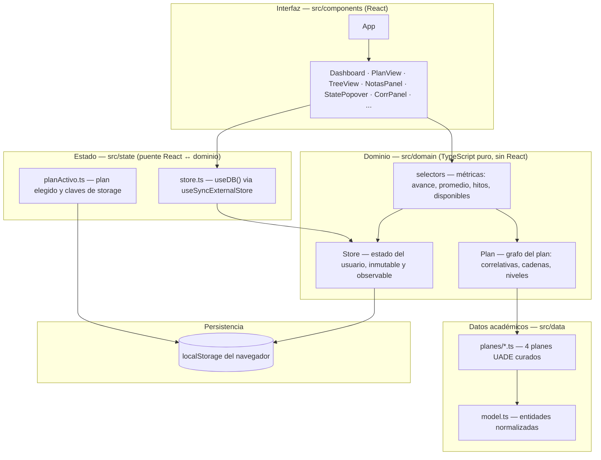
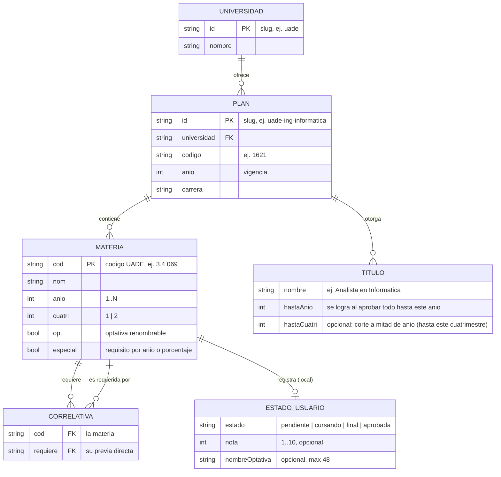
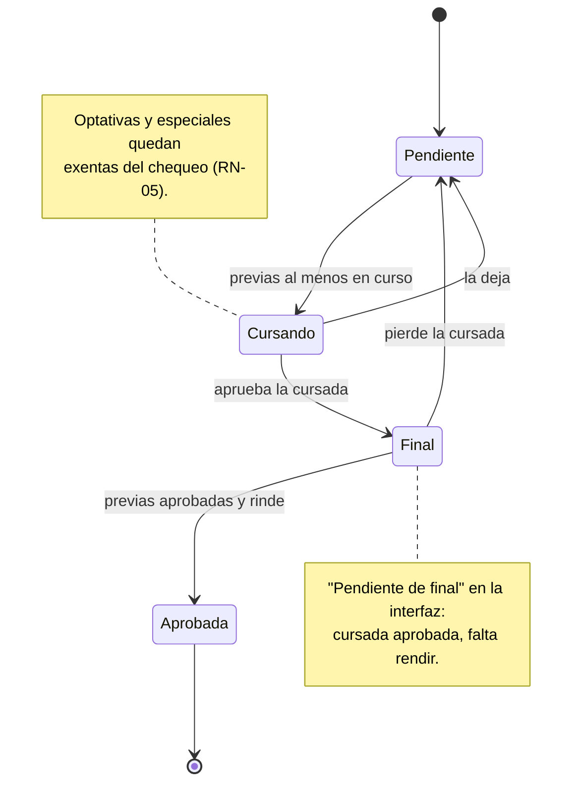
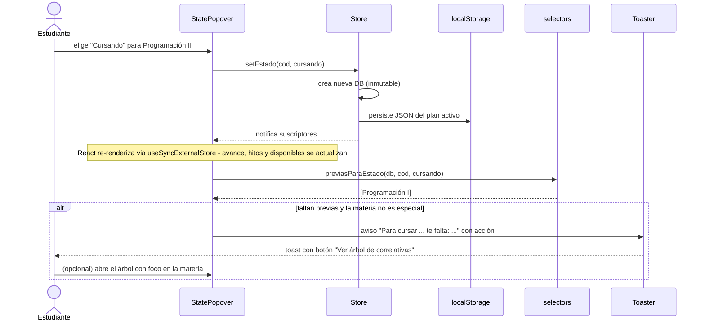

# 4 · Arquitectura

## 4.1 Visión general

**¿Cuánto me falta?** es una SPA **local-first**: toda la lógica corre en el navegador y los datos del usuario nunca salen del dispositivo. No hay backend. La arquitectura se organiza alrededor de tres principios:

1. **Dominio puro.** Las reglas del negocio (el grafo del plan, el estado del usuario, las métricas) viven en clases y funciones de TypeScript **sin ninguna dependencia de React ni del navegador**. Se testean de forma aislada y podrían reutilizarse tal cual en un backend.
2. **Datos académicos normalizados.** Los planes de estudio están modelados como si ya fueran tablas de una base de datos (universidad, plan, materia, correlativa, título). Hoy viven como datos en TypeScript; el día que exista un servidor, migran a filas de una base **sin cambiar el dominio**.
3. **Una sola dirección de dependencias.** La interfaz depende del dominio; el dominio depende de los datos; nadie depende de la interfaz.

## 4.2 Stack y justificación

| Tecnología | Rol | Por qué |
|---|---|---|
| **React 19** | Interfaz | Modelo de componentes y `useSyncExternalStore` nativo para suscribirse a un store propio sin librerías de estado. |
| **TypeScript** (estricto) | Lenguaje | Los datos académicos y las reglas de correlatividad son estructuras ricas; el tipado atrapa errores de carga de datos en compilación. |
| **Vite** | Build y dev server | Arranque instantáneo en desarrollo y bundle de producción liviano para una SPA estática. |
| **@xyflow/react** (React Flow) | Árbol de correlativas | Motor de grafos interactivo (nodos, aristas, pan/zoom); el posicionamiento por año/nivel es un layout propio. |
| **Vitest** | Tests unitarios y de integridad | Corre nativo sobre Vite, mismos paths y TypeScript sin configuración extra. |
| **Playwright** | Tests end-to-end | Simula al usuario real en Chromium dentro del pipeline. |
| **oxlint** | Lint | Linter rápido como primer gate de calidad. |
| **GitHub Actions + Pages** | CI/CD y hosting | Deploy automático de la SPA estática con gate de calidad, sin infraestructura propia. |

## 4.3 Arquitectura en capas



- **`src/components`** — vistas React. No calculan nada: leen del dominio vía selectores y disparan mutaciones sobre el `Store`.
- **`src/state`** — el puente: instancia única del `Store` para el plan activo y el hook `useDB()` que re-renderiza los componentes cuando cambia el estado.
- **`src/domain`** — el corazón: `Plan` (estructura del plan como grafo), `Store` (estado del usuario) y `selectors` (todas las métricas derivadas).
- **`src/data`** — el modelo normalizado y los planes curados.
- **`src/lib`** — utilidades transversales: descarga de archivos (`io`), avisos (`toast`), procesamiento de imagen de perfil (`image`) y analítica agnóstica (`analytics`).

## 4.4 Estructura del repositorio

```
cuanto-me-falta/
├── src/
│   ├── components/        # Vistas React (Dashboard, PlanView, StatePopover, ...)
│   │   └── Tree/          # Árbol de correlativas (nodos, aristas, layout propio)
│   ├── domain/            # Dominio puro + sus tests unitarios
│   │   ├── Plan.ts        #   grafo del plan: antes/después, cadenas, niveles BFS
│   │   ├── Store.ts       #   estado del usuario: inmutable, observable, persistente
│   │   └── selectors.ts   #   avance, promedio, hitos, disponibles, previas faltantes
│   ├── data/
│   │   ├── model.ts       # Entidades normalizadas (la "futura base de datos")
│   │   ├── planes/        # Los 4 planes UADE como datos
│   │   └── integrity.test.ts  # Tests de integridad del grafo académico
│   ├── state/             # Puente React: store singleton + plan activo
│   ├── lib/               # io, toast, image, analytics
│   ├── styles/global.css  # Design tokens + estilos
│   └── types.ts           # Tipos compartidos (Estado, DB, Perfil, ...)
├── e2e/                   # Tests end-to-end (Playwright)
├── public/                # PWA: manifest, service worker, íconos, OG
├── .github/workflows/     # Pipeline CI/CD
├── docs/                  # Esta documentación
└── legacy/                # Versión original (HTML autocontenido), preservada
```

## 4.5 Modelo de datos

El modelo separa dos mundos que nunca se mezclan: los **datos académicos** (estáticos, curados en el repositorio, iguales para todos) y los **datos del usuario** (dinámicos, privados, en su dispositivo). El punto de unión es el código de materia.



Los datos del usuario persisten como un único objeto `DB` por plan: `states` (estado por código de materia), `notas`, `optNames` (nombres de optativas) y `profile` (nombre y foto). Cada interfaz del modelo académico está documentada en el código como la tabla a la que mapeará cuando exista backend (ver ADR-02).

## 4.6 Ciclo de vida de una materia

Los cuatro estados y su camino natural. Importante: el estudiante puede fijar **cualquier** estado en cualquier momento; las condiciones del diagrama son las que la aplicación **verifica para avisar**, no para bloquear (RN-04).



## 4.7 Flujo clave: cambio de estado con aviso de correlativas

El flujo más representativo de la arquitectura: una interacción de la interfaz atraviesa el dominio, persiste, re-renderiza por suscripción y deriva en un aviso accionable.



## 4.8 Persistencia

- **Claves de `localStorage`:** el progreso de cada plan vive bajo su propia clave (`plan-<id>-v3`); el plan por defecto conserva la clave histórica `plan-uade-v3` para no perder los datos de usuarios de versiones anteriores (ADR-08). El plan activo se guarda aparte (`cmf-plan-activo`).
- **Escrituras:** cada mutación del `Store` crea una **nueva referencia inmutable** de la `DB`, persiste de inmediato y notifica a los suscriptores. No hay estados intermedios sin guardar.
- **Respaldo:** el usuario puede exportar/importar la `DB` completa como JSON legible (CU-09/CU-10), que además funciona como mecanismo manual de traslado entre dispositivos mientras no exista sincronización.
- **Resiliencia:** todo acceso a `localStorage` está protegido (entornos sin storage, modo privado estricto): la aplicación degrada a estado en memoria sin romperse, y el dominio es utilizable fuera del navegador (así corren los tests).

## 4.9 Servicios de soporte

- **PWA:** `manifest.webmanifest`, service worker (`sw.js`), íconos estándar y *maskable*, metadatos Open Graph y dominio propio (`CNAME`). Instalable y utilizable offline.
- **Analítica (opcional y anónima):** una capa propia (`lib/analytics.ts`) desacopla la aplicación del proveedor. Hoy usa Umami (sin cookies, sin datos personales, sin banner de consentimiento); cambiar a Plausible u apagarla es tocar variables de entorno, no código de la app. Se desactiva sola en entornos locales para no ensuciar métricas. Registra eventos de producto (activación, backups, exportes), nunca contenido del usuario.

## 4.10 Decisiones de arquitectura (ADR)

**ADR-01 · Local-first, sin backend.** *(Superado por ADR-09 — se conserva como registro histórico.)*
*Contexto:* los datos son personales y el proyecto debe costar $0 de operar. *Decisión:* toda la lógica y la persistencia viven en el cliente. *Consecuencias:* privacidad total, cero infraestructura y funcionamiento offline; a cambio, no hay sincronización entre dispositivos (mitigado con backup portable) y el "servidor" futuro es una evolución, no un requisito.

**ADR-02 · Modelo de datos normalizado como "la base de datos del mañana".**
*Contexto:* la visión incluye más carreras y universidades, con carga por un rol administrador. *Decisión:* modelar universidad/plan/materia/correlativa/título como entidades normalizadas ya hoy, aunque vivan en TypeScript. *Consecuencias:* agregar una carrera es agregar datos (así se incorporaron la Licenciatura y la Tecnicatura); la migración a una base real no requiere tocar el dominio.

**ADR-03 · Dominio puro, sin React.**
*Contexto:* las reglas de correlatividad y las métricas son lo más delicado del sistema. *Decisión:* `Plan`, `Store` y `selectors` son TypeScript puro, sin imports de React ni del DOM. *Consecuencias:* 48 tests unitarios corren en milisegundos sin navegador; el mismo dominio podría ejecutarse en un servidor.

**ADR-04 · Store propio con `useSyncExternalStore` en lugar de Redux/Zustand.**
*Contexto:* el estado es un único objeto pequeño con pocas mutaciones. *Decisión:* un store observable propio (~130 líneas) con actualizaciones inmutables, conectado a React con la API nativa. *Consecuencias:* cero dependencias de estado, control total del ciclo persistir→notificar y un punto único donde auditar cada mutación.

**ADR-05 · El aviso de correlativas informa, no bloquea.**
*Contexto:* la realidad académica tiene excepciones (equivalencias, autorizaciones) que la aplicación no puede conocer. *Decisión:* validar y avisar con detalle (qué falta y para qué), pero respetar siempre la decisión del estudiante. *Consecuencias:* la app nunca "se equivoca en contra" del usuario; el costo es tolerar estados formalmente inconsistentes, que el aviso hace visibles.

**ADR-06 · React Flow (@xyflow/react) con layout propio para el árbol.** *(El ruteo artesanal fue superado por ADR-10 — se conserva como registro.)*
*Contexto:* el grafo de correlativas es la funcionalidad visual más compleja. *Decisión:* usar React Flow para nodos/aristas/interacción y resolver el posicionamiento (bandas por año, carriles) con un layout propio determinístico. *Consecuencias:* interacción robusta sin reinventar un motor de grafos, y un dibujo que respeta la semántica académica (los años se leen en orden).

**ADR-07 · Analítica sin cookies y agnóstica del proveedor.**
*Contexto:* se necesita entender el uso agregado sin comprometer el principio de privacidad. *Decisión:* proveedores cookieless (Umami/Plausible) detrás de una interfaz propia, configurados por entorno. *Consecuencias:* métricas de producto sin datos personales ni banner de consentimiento, y libertad de cambiar de proveedor sin tocar la aplicación.

**ADR-08 · Compatibilidad con datos de versiones anteriores.**
*Contexto:* la app ya tenía usuarios con progreso guardado cuando se migró de la versión original (HTML autocontenido) a React. *Decisión:* conservar la clave histórica de storage para el plan por defecto. *Consecuencias:* nadie perdió su progreso en la migración; el costo es una asimetría documentada en las claves de storage.

**ADR-09 · Sincronización opcional con Supabase + login de Google.** *(Supersede a ADR-01.)*
*Contexto:* las primeras métricas del lanzamiento (jul-2026) mostraron que el 81 % de los visitantes no marcaba ninguna materia; el análisis del embudo y el feedback directo señalaron la misma causa: sin sincronización, cargar el progreso "se siente efímero" (cambiar de dispositivo lo pierde). El backend dejó de ser una apuesta y pasó a ser respuesta a demanda medida. *Decisión:* incorporar **Supabase** (Postgres gestionado + auth) con **login de Google** como única vía inicial. El modelo remoto es deliberadamente simple: una fila por usuario con todo el progreso en JSON (`user_id`, `data`, `updated_at`), protegida por **Row Level Security** (cada cuenta lee y escribe solo su fila). El cliente sigue siendo local-first: `localStorage` es la fuente inmediata y la caché offline; cada cambio se sube con *debounce*; al iniciar sesión se decide el merge (subir / bajar / nada / **conflicto que resuelve el usuario** — nunca se pisa progreso sin preguntar). Sin credenciales configuradas, toda la capa desaparece y la app queda 100 % local (dev, CI y quien no quiera cuenta). *Consecuencias:* sincronización multi-dispositivo (el pedido n.º 1), la base del futuro panel institucional, y la app sigue completa sin cuenta; a cambio, las notas pasan a ser datos personales almacenados (Ley 25.326) — de ahí el consentimiento explícito previo al primer sincronizado y las páginas de Términos y Privacidad — y aparece el primer costo operativo potencial (free tier de Supabase hoy).

**ADR-10 · Motor de layout del árbol: grilla propia para la malla, ELK para la rama.** *(Supersede el ruteo artesanal de ADR-06.)*
*Contexto:* el ruteo propio por carriles funcionaba en planes chicos, pero en Ingeniería una materia con fan-out alto trenzaba todas sus aristas largas en el mismo canal; parcharlo caso a caso no garantizaba nada para los planes que cargue el futuro rol admin. El uso real dejó además una definición de producto: la malla en reposo se entiende mejor **limpia** (sin flechas), y las correlatividades se consultan tocando una materia. *Decisión:* dos vistas, dos motores. La **malla** es una grilla determinística propia — una fila por cuatrimestre, orden por baricentro, columnas en slots exactos, respiro entre años — **sin aristas**. Al seleccionar una materia, el **modo rama** re-acomoda el subgrafo de su cadena con **elkjs** (`layered` + particiones por índice global de cuatrimestre + ruteo ortogonal + `mergeEdges`), lo encuadra con una animación y desenfoca el resto; el motor garantiza por construcción la separación de aristas que antes se intentaba a mano. Como red de seguridad, **invariantes geométricos en CI**: para cada plan y para la rama de cada materia (~150 layouts) se verifica que ninguna arista atraviese tarjetas ajenas, que no haya verticales de distinto origen pegadas, que todo fluya hacia abajo y que las filas respeten el orden temporal — "quedó mal" es build rojo, también para planes futuros. *Consecuencias:* el caso patológico rinde limpio; como elkjs pesa ~460 KB gz, el árbol completo (ELK + React Flow) vive en un *chunk* diferido que se precalienta en segundo plano — el bundle inicial bajó de 468 a 132 KB gz y el service worker deja el chunk cacheado para offline; el feedback temprano "flechas desde un inicio" quedó superado por la decisión de producto de malla limpia + rama a demanda.

## 4.11 Evolución futura (técnica)

La arquitectura deja preparado el camino sin hipotecar el presente:

- **Backend y sincronización:** ✅ primera etapa hecha (ADR-09): auth con Google y sync del progreso vía Supabase. Queda para el futuro migrar el modelo académico normalizado (§4.5) a tablas y reutilizar el dominio puro del lado del servidor.
- **Rol administrador:** la carga de planes que hoy se hace por código pasa a una interfaz de administración que escribe las mismas entidades.
- **Más planes y universidades:** ya soportado por datos; el selector de carrera y el registro de planes están diseñados para N planes de M universidades.
