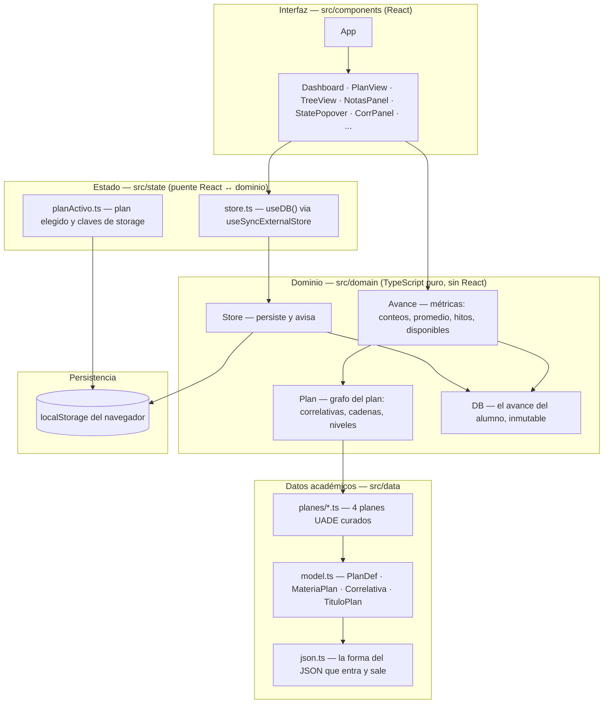
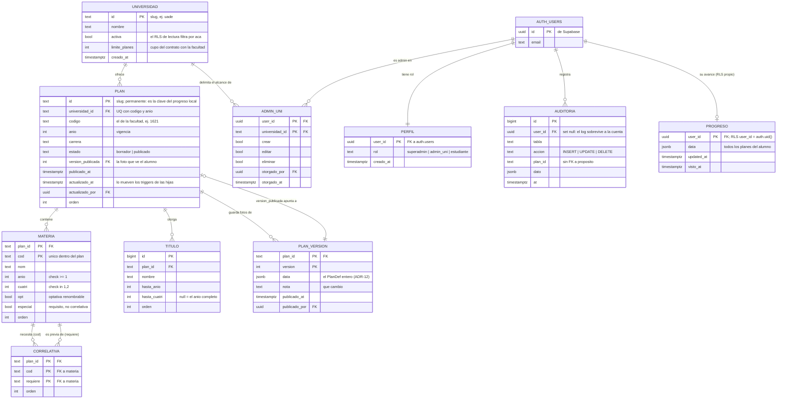
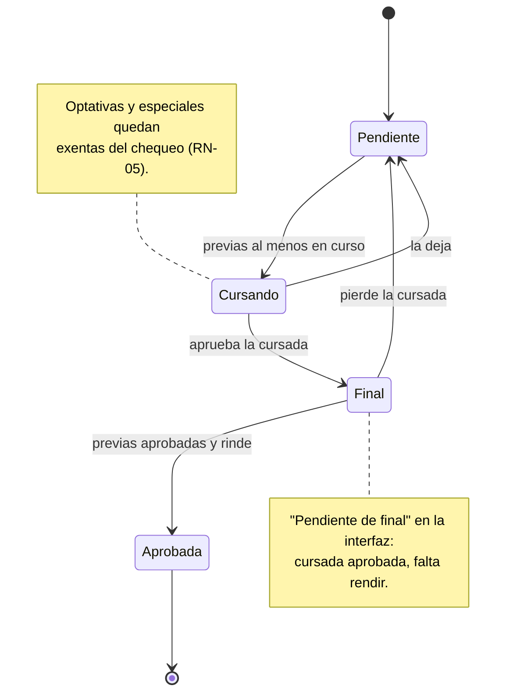
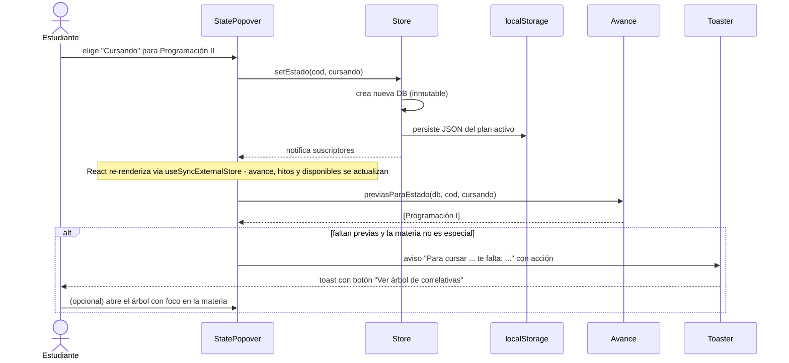

# 4 · Arquitectura

## 4.1 Visión general

**¿Cuánto me falta?** es una SPA **local-first**: toda la lógica corre en el navegador y el avance del estudiante vive en su dispositivo. Hay backend (Supabase) para dos cosas y ninguna más: **sincronizar** el avance entre los dispositivos de una misma persona, si ella lo elige, y **servir los planes de estudio** que carga la administración. La app abre y funciona completa sin red, sin cuenta y sin backend configurado. La arquitectura se organiza alrededor de cuatro principios:

1. **Dominio orientado a objetos y puro.** Las reglas del negocio —el grafo del plan, el avance del estudiante, las métricas, la validación, los permisos— viven en **clases** de TypeScript **sin ninguna dependencia de React ni del navegador**. Se testean aisladas y podrían reutilizarse tal cual en un servidor (ver ADR-13).
2. **Datos académicos normalizados.** Universidad, plan, materia, correlativa y título son tablas en el backend y clases en el cliente, con el mismo modelo de un lado y del otro (ADR-11).
3. **Una sola frontera para el dato que entra.** Todo lo que llega por JSON —el bundle, la vista de Supabase, el caché de `localStorage`— pasa por una factory `desde()` antes de ser un objeto. Fuera de esa frontera no existen datos crudos.
4. **Una sola dirección de dependencias.** La interfaz depende del dominio; el dominio depende de los datos; nadie depende de la interfaz.

## 4.2 Stack y justificación

| Tecnología | Rol | Por qué |
|---|---|---|
| **React 19** | Interfaz | Modelo de componentes y `useSyncExternalStore` nativo para suscribirse a un store propio sin librerías de estado. |
| **TypeScript** (estricto) | Lenguaje | Los datos académicos y las reglas de correlatividad son estructuras ricas; el tipado atrapa errores de carga de datos en compilación. |
| **Vite** | Build y dev server | Arranque instantáneo en desarrollo y bundle de producción liviano para una SPA estática. |
| **@xyflow/react** (React Flow) | Árbol de correlativas | Motor de grafos interactivo (nodos, aristas, pan/zoom); el posicionamiento por año/nivel es un layout propio. |
| **Vitest** | Tests unitarios y de integridad | Corre nativo sobre Vite, mismos paths y TypeScript sin configuración extra. |
| **Playwright** | Tests end-to-end | Simula al usuario real en Chromium dentro del pipeline. |
| **oxlint** | Lint | Linter rápido como primer gate de calidad. |
| **GitHub Actions + Pages** | CI/CD y hosting | Deploy automático de la SPA estática con gate de calidad, sin infraestructura propia. |

## 4.3 Arquitectura en capas


```mermaid
%% svg:capas
flowchart TB
    subgraph UI["Interfaz — src/components (React)"]
        APP["App"]
        VIS["Dashboard · PlanView · TreeView · NotasPanel · StatePopover · CorrPanel · ..."]
    end
    subgraph PUENTE["Estado — src/state (puente React ↔ dominio)"]
        HOOK["store.ts — useDB() via useSyncExternalStore"]
        PLANACT["planActivo.ts — plan elegido y claves de storage"]
    end
    subgraph DOM["Dominio — src/domain (TypeScript puro, sin React)"]
        PLAN["Plan — grafo del plan: correlativas, cadenas, niveles"]
        STORE["Store — persiste y avisa"]
        DB["DB — el avance del alumno, inmutable"]
        AV["Avance — métricas: conteos, promedio, hitos, disponibles"]
    end
    subgraph DATA["Datos académicos — src/data"]
        MODEL["model.ts — PlanDef · MateriaPlan · Correlativa · TituloPlan"]
        JSONF["json.ts — la forma del JSON que entra y sale"]
        PLANES["planes/*.ts — 4 planes UADE curados"]
    end
    subgraph PERS["Persistencia"]
        LS[("localStorage del navegador")]
    end
    APP --> VIS
    VIS --> HOOK
    HOOK --> STORE
    VIS --> AV
    AV --> PLAN
    AV --> DB
    STORE --> DB
    PLAN --> PLANES
    PLANES --> MODEL
    MODEL --> JSONF
    PLANACT --> LS
    STORE --> LS
```

- **`src/components`** — vistas React. No calculan nada: leen del dominio y disparan mutaciones sobre el `Store`. Son **funciones**, no clases: en React 19 un componente de clase no puede usar hooks, y el puente entre el `Store` y React (`useSyncExternalStore`) es uno. El límite lo pone el framework.
- **`src/state`** — el puente y el I/O: la instancia única del `Store`, el hook `useDB()`, y los repositorios contra Supabase (`RepositorioPlanes`, `Sync`, `Auth`, `RefrescoDePlanes`).
- **`src/domain`** — el corazón: `Plan` (el plan como grafo, con sus índices derivados), `DB` (el avance del alumno, inmutable, dueña de sus propias transiciones), `Store` (persiste y notifica) y `Avance` (todas las métricas derivadas).
- **`src/data`** — el modelo académico como objetos (`model.ts`), la forma del JSON que cruza la frontera (`json.ts`) y los planes curados.
- **`src/lib`** — el resto de la lógica de negocio, también como objetos: `Borrador` y `Diff` (el editor), `Validacion` (las reglas de un plan), `SesionAdmin` y `Cupo` (permisos), `Grafo` y `Layout` (el árbol), `RemoteData` (la sincronización), `Analytics`, `Archivo`, `Foto`, `ToastBus`.

## 4.4 Estructura del repositorio

```
cuanto-me-falta/
├── src/
│   ├── components/        # Vistas React (Dashboard, PlanView, StatePopover, ...)
│   │   └── Tree/          # Árbol de correlativas (nodos, aristas, layout propio)
│   ├── admin/             # Pantalla de administración (#admin), chunk aparte
│   ├── domain/            # Dominio puro + sus tests unitarios
│   │   ├── Plan.ts        #   Plan · Anio · Cuatri · MateriaUbicada — el grafo
│   │   ├── Store.ts       #   Store — persiste el avance y avisa a quien mire
│   │   └── Avance.ts      #   Avance — conteos, promedio, hitos, disponibles
│   ├── data/
│   │   ├── model.ts       #   PlanDef · MateriaPlan · Correlativa · TituloPlan · Universidad
│   │   ├── json.ts        #   la FORMA del JSON que entra y sale (no es el dominio)
│   │   ├── registro.ts    #   Registro — snapshot del bundle + caché del backend
│   │   ├── planes/        #   Los 4 planes UADE como literales JSON
│   │   └── integrity.test.ts  # Los planes reales pasan el validador
│   ├── state/             # Puente React + I/O: Store singleton, repositorios, sync
│   ├── lib/               # Borrador · Diff · Validacion · SesionAdmin · Grafo · RemoteData …
│   ├── styles/global.css  # Design tokens + estilos
│   └── types.ts           # DB · Perfil · Espejo · MateriaCustom — el avance del alumno
├── supabase/              # Migraciones SQL, en orden (001 … 007)
├── e2e/                   # Tests end-to-end (Playwright)
├── public/                # PWA: manifest, service worker, íconos, OG
├── .github/workflows/     # Pipeline CI/CD
├── docs/                  # Esta documentación
└── legacy/                # Versión original (HTML autocontenido), preservada
```

## 4.5 Modelo de datos

El modelo separa dos mundos que nunca se mezclan: los **datos académicos** (curados, iguales para todos, hoy en tablas del backend con el bundle como piso — ver ADR-11) y los **datos del usuario** (dinámicos, privados, en su dispositivo y opcionalmente sincronizados con su cuenta). El punto de unión es el código de materia, y nada más.

### Las tablas

Diez tablas en tres zonas. Las académicas son de lectura pública; las de permisos deciden quién puede escribirlas; y `progreso` —el avance del alumno— **no tiene una sola FK hacia ninguna de las otras dos**, con RLS `user_id = auth.uid()`: por construcción, ningún rol —ni el superadmin— puede leer el avance de nadie (verificado en `supabase/003-verificar-permisos.sql`).


```mermaid
%% svg:der
erDiagram
    UNIVERSIDAD  ||--o{ PLAN         : ofrece
    UNIVERSIDAD  ||--o{ ADMIN_UNI    : "delimita el alcance de"
    PLAN         ||--o{ MATERIA      : contiene
    PLAN         ||--o{ TITULO       : otorga
    PLAN         ||--o{ PLAN_VERSION : "guarda fotos de"
    PLAN_VERSION ||--o| PLAN         : "version_publicada apunta a"
    MATERIA      ||--o{ CORRELATIVA  : "necesita (cod)"
    MATERIA      ||--o{ CORRELATIVA  : "es previa de (requiere)"
    AUTH_USERS   ||--|| PERFIL       : "tiene rol"
    AUTH_USERS   ||--o{ ADMIN_UNI    : "es admin en"
    AUTH_USERS   ||--o{ AUDITORIA    : registra
    AUTH_USERS   ||--o| PROGRESO     : "su avance (RLS propio)"

    UNIVERSIDAD {
        text id PK "slug, ej. uade"
        text nombre
        bool activa "el RLS de lectura filtra por aca"
        int limite_planes "cupo del contrato con la facultad"
        timestamptz creado_at
    }
    PLAN {
        text id PK "slug; permanente: es la clave del progreso local"
        text universidad_id FK "UQ con codigo y anio"
        text codigo "el de la facultad, ej. 1621"
        int anio "vigencia"
        text carrera
        text estado "borrador | publicado"
        int version_publicada FK "la foto que ve el alumno"
        timestamptz publicado_at
        timestamptz actualizado_at "lo mueven los triggers de las hijas"
        uuid actualizado_por FK
        int orden
    }
    MATERIA {
        text plan_id PK "FK"
        text cod PK "unico dentro del plan"
        text nom
        int anio "check >= 1"
        int cuatri "check in 1,2"
        bool opt "optativa renombrable"
        bool especial "requisito, no correlativa"
        int orden
    }
    CORRELATIVA {
        text plan_id PK "FK"
        text cod PK "FK a materia"
        text requiere PK "FK a materia"
        int orden
    }
    TITULO {
        bigint id PK
        text plan_id FK
        text nombre
        int hasta_anio
        int hasta_cuatri "null = el anio completo"
        int orden
    }
    PLAN_VERSION {
        text plan_id PK "FK"
        int version PK
        jsonb data "el PlanDef entero (ADR-12)"
        text nota "que cambio"
        timestamptz publicado_at
        uuid publicado_por FK
    }
    PERFIL {
        uuid user_id PK "FK a auth.users"
        text rol "superadmin | admin_uni | estudiante"
        timestamptz creado_at
    }
    ADMIN_UNI {
        uuid user_id PK "FK"
        text universidad_id PK "FK"
        bool crear
        bool editar
        bool eliminar
        uuid otorgado_por FK
        timestamptz otorgado_at
    }
    AUDITORIA {
        bigint id PK
        uuid user_id FK "set null: el log sobrevive a la cuenta"
        text tabla
        text accion "INSERT | UPDATE | DELETE"
        text plan_id "sin FK a proposito"
        jsonb dato
        timestamptz at
    }
    PROGRESO {
        uuid user_id PK "FK; RLS user_id = auth.uid()"
        jsonb data "todos los planes del alumno"
        timestamptz updated_at
        timestamptz visto_at
    }
    AUTH_USERS {
        uuid id PK "de Supabase"
        text email
    }
```

**Tres decisiones del esquema que sostienen el resto:**

- **La PK compuesta `(plan_id, cod)` de `materia`.** Es lo que permite que `correlativa` referencie materias **por FK**: la base misma hace imposible una correlativa hacia un código inexistente o de otro plan, incluso vía API. El `cod` se repite entre planes, nunca dentro de uno.
- **Las columnas `orden`** en `plan`, `materia` y `correlativa`. Sin ellas el mismo plan podría volver en otro orden y cambiar cómo se dibuja.
- **`plan_version.data` es una desnormalización deliberada** (ADR-12): la foto del plan publicado en JSON. Publicar es un `INSERT` + un `UPDATE` del puntero; volver atrás es mover el puntero. Lo mismo vale para `auditoria.dato` (un log tiene que ser inmutable y sobrevivir al borrado) y `progreso.data` (last-write-wins sobre un JSON por usuario). Las tres se leen íntegras y nunca se consultan por adentro.

Las cinco tablas académicas están en 3FN. Una auditoría del 11-ago-2026 encontró y corrigió cinco desvíos (migraciones `006` y `007`): `limite_planes` vivía en `admin_uni` cuando depende solo de la universidad —una dependencia parcial que hacía que el cupo real dependiera de qué admin apretara el botón—, `plan.version` había quedado muerta desde ADR-12, faltaba el índice de `correlativa (plan_id, requiere)` que usan sus FKs en cascada, sobraba un índice redundante con la PK de `plan_version`, y cada edición escribía dos filas de auditoría (una sin información).

### Los objetos

Cada tabla mapea 1:1 a una clase de `src/data/model.ts`, y el avance del alumno a las de `src/types.ts` (ver ADR-13). El JSON que cruza la frontera —el bundle, la vista `plan_publicado`, el caché de `localStorage`— se describe aparte en `src/data/json.ts` y entra **siempre** por una factory `desde()`.

## 4.6 Ciclo de vida de una materia

Los cuatro estados y su camino natural. Importante: el estudiante puede fijar **cualquier** estado en cualquier momento; las condiciones del diagrama son las que la aplicación **verifica para avisar**, no para bloquear (RN-04).


```mermaid
%% svg:estados
stateDiagram-v2
    [*] --> Pendiente
    Pendiente --> Cursando : previas al menos en curso
    Cursando --> Final : aprueba la cursada
    Final --> Aprobada : previas aprobadas y rinde
    Cursando --> Pendiente : la deja
    Final --> Pendiente : pierde la cursada
    Aprobada --> [*]
    note right of Final
        "Pendiente de final" en la interfaz:
        cursada aprobada, falta rendir.
    end note
    note left of Cursando
        Optativas y especiales quedan
        exentas del chequeo (RN-05).
    end note
```

## 4.7 Flujo clave: cambio de estado con aviso de correlativas

El flujo más representativo de la arquitectura: una interacción de la interfaz atraviesa el dominio, persiste, re-renderiza por suscripción y deriva en un aviso accionable.


```mermaid
%% svg:secuencia
sequenceDiagram
    actor E as Estudiante
    participant UI as StatePopover
    participant ST as Store
    participant LS as localStorage
    participant SEL as Avance
    participant TO as Toaster

    E->>UI: elige "Cursando" para Programación II
    UI->>ST: setEstado(cod, cursando)
    ST->>ST: crea nueva DB (inmutable)
    ST->>LS: persiste JSON del plan activo
    ST-->>UI: notifica suscriptores
    Note over UI: React re-renderiza via useSyncExternalStore - avance, hitos y disponibles se actualizan
    UI->>SEL: previasParaEstado(db, cod, cursando)
    SEL-->>UI: [Programación I]
    alt faltan previas y la materia no es especial
        UI->>TO: aviso "Para cursar ... te falta: ..." con acción
        TO-->>E: toast con botón "Ver árbol de correlativas"
        E->>UI: (opcional) abre el árbol con foco en la materia
    end
```

## 4.8 Persistencia

- **Claves de `localStorage`:** el progreso de cada plan vive bajo su propia clave (`plan-<id>-v3`); el plan por defecto conserva la clave histórica `plan-uade-v3` para no perder los datos de usuarios de versiones anteriores (ADR-08). El plan activo se guarda aparte (`cmf-plan-activo`).
- **Escrituras:** cada mutación del `Store` crea una **nueva referencia inmutable** de la `DB`, persiste de inmediato y notifica a los suscriptores. No hay estados intermedios sin guardar.
- **Respaldo:** el usuario puede exportar/importar la `DB` completa como JSON legible (CU-09/CU-10), que además funciona como mecanismo manual de traslado entre dispositivos mientras no exista sincronización.
- **Resiliencia:** todo acceso a `localStorage` está protegido (entornos sin storage, modo privado estricto): la aplicación degrada a estado en memoria sin romperse, y el dominio es utilizable fuera del navegador (así corren los tests).

## 4.9 Servicios de soporte

- **PWA:** `manifest.webmanifest`, service worker (`sw.js`), íconos estándar y *maskable*, metadatos Open Graph y dominio propio (`CNAME`). Instalable y utilizable offline.
- **Analítica (opcional y anónima):** una capa propia (`lib/analytics.ts`) desacopla la aplicación del proveedor. Hoy usa Umami (sin cookies, sin datos personales, sin banner de consentimiento); cambiar a Plausible u apagarla es tocar variables de entorno, no código de la app. Se desactiva sola en entornos locales para no ensuciar métricas. Registra eventos de producto (activación, backups, exportes), nunca contenido del usuario.

## 4.10 Decisiones de arquitectura (ADR)

**ADR-01 · Local-first, sin backend.** *(Superado por ADR-09 — se conserva como registro histórico.)*
*Contexto:* los datos son personales y el proyecto debe costar $0 de operar. *Decisión:* toda la lógica y la persistencia viven en el cliente. *Consecuencias:* privacidad total, cero infraestructura y funcionamiento offline; a cambio, no hay sincronización entre dispositivos (mitigado con backup portable) y el "servidor" futuro es una evolución, no un requisito.

**ADR-02 · Modelo de datos normalizado como "la base de datos del mañana".**
*Contexto:* la visión incluye más carreras y universidades, con carga por un rol administrador. *Decisión:* modelar universidad/plan/materia/correlativa/título como entidades normalizadas ya hoy, aunque vivan en TypeScript. *Consecuencias:* agregar una carrera es agregar datos (así se incorporaron la Licenciatura y la Tecnicatura); la migración a una base real no requiere tocar el dominio.

**ADR-03 · Dominio puro, sin React.**
*Contexto:* las reglas de correlatividad y las métricas son lo más delicado del sistema. *Decisión:* el dominio (`Plan`, `Store`, `DB`, `Avance`) es TypeScript puro, sin imports de React ni del DOM. *Consecuencias:* los tests unitarios corren en milisegundos sin navegador y el mismo dominio podría ejecutarse en un servidor. **ADR-13 lo extiende**: el resto de la lógica de negocio siguió el mismo camino y todo el dominio pasó a ser objetos.

**ADR-04 · Store propio con `useSyncExternalStore` en lugar de Redux/Zustand.**
*Contexto:* el estado es un único objeto pequeño con pocas mutaciones. *Decisión:* un store observable propio (~130 líneas) con actualizaciones inmutables, conectado a React con la API nativa. *Consecuencias:* cero dependencias de estado, control total del ciclo persistir→notificar y un punto único donde auditar cada mutación.

**ADR-05 · El aviso de correlativas informa, no bloquea.**
*Contexto:* la realidad académica tiene excepciones (equivalencias, autorizaciones) que la aplicación no puede conocer. *Decisión:* validar y avisar con detalle (qué falta y para qué), pero respetar siempre la decisión del estudiante. *Consecuencias:* la app nunca "se equivoca en contra" del usuario; el costo es tolerar estados formalmente inconsistentes, que el aviso hace visibles.

**ADR-06 · React Flow (@xyflow/react) con layout propio para el árbol.** *(El ruteo artesanal fue superado por ADR-10 — se conserva como registro.)*
*Contexto:* el grafo de correlativas es la funcionalidad visual más compleja. *Decisión:* usar React Flow para nodos/aristas/interacción y resolver el posicionamiento (bandas por año, carriles) con un layout propio determinístico. *Consecuencias:* interacción robusta sin reinventar un motor de grafos, y un dibujo que respeta la semántica académica (los años se leen en orden).

**ADR-07 · Analítica sin cookies y agnóstica del proveedor.**
*Contexto:* se necesita entender el uso agregado sin comprometer el principio de privacidad. *Decisión:* proveedores cookieless (Umami/Plausible) detrás de una interfaz propia, configurados por entorno. *Consecuencias:* métricas de producto sin datos personales ni banner de consentimiento, y libertad de cambiar de proveedor sin tocar la aplicación.

**ADR-08 · Compatibilidad con datos de versiones anteriores.**
*Contexto:* la app ya tenía usuarios con progreso guardado cuando se migró de la versión original (HTML autocontenido) a React. *Decisión:* conservar la clave histórica de storage para el plan por defecto. *Consecuencias:* nadie perdió su progreso en la migración; el costo es una asimetría documentada en las claves de storage.

**ADR-09 · Sincronización opcional con Supabase + login de Google.** *(Supersede a ADR-01.)*
*Contexto:* las primeras métricas del lanzamiento (jul-2026) mostraron que el 81 % de los visitantes no marcaba ninguna materia; el análisis del embudo y el feedback directo señalaron la misma causa: sin sincronización, cargar el progreso "se siente efímero" (cambiar de dispositivo lo pierde). El backend dejó de ser una apuesta y pasó a ser respuesta a demanda medida. *Decisión:* incorporar **Supabase** (Postgres gestionado + auth) con **login de Google** como única vía inicial. El modelo remoto es deliberadamente simple: una fila por usuario con todo el progreso en JSON (`user_id`, `data`, `updated_at`), protegida por **Row Level Security** (cada cuenta lee y escribe solo su fila). El cliente sigue siendo local-first: `localStorage` es la fuente inmediata y la caché offline; cada cambio se sube con *debounce*; al iniciar sesión se decide el merge (subir / bajar / nada / **conflicto que resuelve el usuario** — nunca se pisa progreso sin preguntar). Sin credenciales configuradas, toda la capa desaparece y la app queda 100 % local (dev, CI y quien no quiera cuenta). *Consecuencias:* sincronización multi-dispositivo (el pedido n.º 1), la base del futuro panel institucional, y la app sigue completa sin cuenta; a cambio, las notas pasan a ser datos personales almacenados (Ley 25.326) — de ahí el consentimiento explícito previo al primer sincronizado y las páginas de Términos y Privacidad — y aparece el primer costo operativo potencial (free tier de Supabase hoy).

**ADR-10 · Motor de layout del árbol: grilla propia para la malla, ELK para la rama.** *(Supersede el ruteo artesanal de ADR-06.)*
*Contexto:* el ruteo propio por carriles funcionaba en planes chicos, pero en Ingeniería una materia con fan-out alto trenzaba todas sus aristas largas en el mismo canal; parcharlo caso a caso no garantizaba nada para los planes que cargue el futuro rol admin. El uso real dejó además una definición de producto: la malla en reposo se entiende mejor **limpia** (sin flechas), y las correlatividades se consultan tocando una materia. *Decisión:* dos vistas, dos motores. La **malla** es una grilla determinística propia — una fila por cuatrimestre, orden por baricentro, columnas en slots exactos, respiro entre años — **sin aristas**. Al seleccionar una materia, el **modo rama** re-acomoda el subgrafo de su cadena con **elkjs** (`layered` + particiones por índice global de cuatrimestre + ruteo ortogonal + `mergeEdges`), lo encuadra con una animación y desenfoca el resto; el motor garantiza por construcción la separación de aristas que antes se intentaba a mano. Como red de seguridad, **invariantes geométricos en CI**: para cada plan y para la rama de cada materia (~150 layouts) se verifica que ninguna arista atraviese tarjetas ajenas, que no haya verticales de distinto origen pegadas, que todo fluya hacia abajo y que las filas respeten el orden temporal — "quedó mal" es build rojo, también para planes futuros. *Consecuencias:* el caso patológico rinde limpio; como elkjs pesa ~460 KB gz, el árbol completo (ELK + React Flow) vive en un *chunk* diferido que se precalienta en segundo plano — el bundle inicial bajó de 468 a 132 KB gz y el service worker deja el chunk cacheado para offline.

**ADR-10b · La malla en reposo vuelve a mostrar el esqueleto: solo las correlativas cortas.** *(Ajusta la decisión de producto de ADR-10; el motor no cambia.)*
*Contexto:* con la malla completamente limpia, quien abre el árbol ve una grilla ordenada pero **no ve que sea un árbol**: la estructura —el motivo por el que se entra— queda escondida detrás de un clic que no todos descubren. Lo pedía el feedback de los usuarios ("flechas desde un inicio") y lo confirmó el uso: tras el rediseño, las aperturas del árbol por visitante bajaron. Dibujarlas **todas** no es opción: eso era exactamente la trenza que motivó ADR-10. *Decisión:* medido sobre los cuatro planes, **el 83 % de las correlativas salta uno o dos cuatrimestres**; esas son cortas, se rutean por los pasillos que quedan entre filas y no se cruzan con nada, mientras que el 17 % restante —las largas— son las que armaban la trenza. En reposo se dibujan las cortas, tenues; las largas siguen apareciendo solo en modo rama. El ruteo es determinístico sobre la grilla (no hay búsqueda de caminos): baja al pasillo, corre por un carril propio y, si tiene que atravesar una fila, la cruza por un **slot libre** de esa fila o, si no hay, por el pasillo entre columnas, siempre penalizando salirse del tramo que une las dos materias. *Regla dura:* una arista que **no** encuentre paso limpio **no se dibuja** — se prefiere mostrar menos esqueleto antes que volver a ensuciar la malla. *Consecuencias:* la estructura se lee de entrada sin perder la limpieza; los invariantes de CI ahora corren también sobre las aristas de la malla — y verifican las paralelas pegadas en **los dos sentidos**, no solo las verticales: “las flechas se tocan entre sí” es build rojo (RN-14). Los carriles de cada pasillo se reparten por **coloreo de intervalos** (dos horizontales que se solapan nunca comparten carril, las que no se solapan sí, sin gastar alto), y como el alto necesario depende de eso, el ruteo se **planifica antes** de acomodar las filas: cada pasillo crece solo lo que sus carriles piden y el resto queda apretado. Y ambas vistas dibujan la **reducción transitiva** del grafo: los planes declaran muchas correlativas deducibles (Machine Learning I pide Estadística *y* Inferencia, que ya pide Estadística), y dibujarlas obliga a la flecha a rodear la materia del medio — se ve como un lazo — y, si sale del mismo nodo que otra, ELK las fusiona en un tronco compartido que quedaba pintado de dos colores. Sacarlas no pierde información (la dependencia se lee por el camino) y garantiza que ninguna arista salte del "necesitás" al "habilita", con lo cual ningún tronco puede quedar bicolor; los tests verifican las dos cosas.

**ADR-11 · Datos académicos en el backend, con el bundle como snapshot de arranque.** *(Primera etapa del modelo académico en tablas; el registro en módulos TS de §4.5 pasa a ser el piso, no la única fuente.)*
*Contexto:* mientras los planes vivían solo en TypeScript, cargar una carrera exigía un archivo de código y un deploy — o sea, dependía de una sola persona. El modelo de `src/data/model.ts` ya estaba normalizado 1:1 contra tablas justamente para este momento. Lo que hay que resolver no es el modelo, es **de dónde lee la app sin perder nada de lo que ya funciona**: abre sin red (PWA instalada), sin cuenta y sin backend configurado, y ocho módulos hacen `import { PLANES }` de forma sincrónica.
*Decisión:* **snapshot + refresco.** Los planes del repo siguen viajando en el bundle y son el piso. Al importar `data/planes`, `Registro.inicial()` lee de forma **sincrónica** un caché de `localStorage` (bajado en una visita anterior) y, si sirve, ese gana; si no, el bundle. El refresco contra el backend corre **después de que la app pintó**, en idle (`src/state/planesRemoto.ts`), y **solo escribe el caché**: no reemplaza los planes en caliente. La app lee una vista, `plan_publicado`, que devuelve un plan por fila con la forma exacta de `PlanDef` (`security_invoker`, así el RLS del que pregunta decide: desde el navegador solo salen los planes en estado `publicado`). Si el backend dice exactamente lo mismo que el bundle, **no se guarda caché alguno**: el caché existe únicamente cuando el backend diverge del snapshot publicado.
*Alternativas descartadas:* (a) *fetch bloqueante al arrancar* — le agrega latencia al 100 % de las visitas y rompe el offline, por un dato que cambia dos veces al año; (b) *reemplazar los planes en caliente al llegar la respuesta* — un plan que se mueve debajo de un usuario a mitad de sesión es peor que esperar a que vuelva a abrir; (c) *armar el plan en el cliente con cinco consultas* — más viajes y más lugares donde equivocarse que una vista que ya entrega el JSON armado.
*Consecuencias:* cargar una carrera deja de necesitar un deploy. El orden se preserva con columnas `orden` en `plan`, `materia` y `correlativa` (sin eso, el mismo plan podría volver en otro orden y cambiar cómo se dibuja). El dato de red se desconfía: `PlanDef.desde()` valida la forma y **`Validacion` descarta cualquier plan roto antes de que llegue a la UI** — mejor mostrar tres carreras que una con las correlativas en círculo. Las mismas reglas corren en CI, en el editor (no se publica con errores) y en el arranque, una sola implementación. La base refuerza aparte un subconjunto con constraints: la PK compuesta `(plan_id, cod)` y las FKs compuestas de `correlativa` hacen **imposible** una correlativa que apunte a un código inexistente o a otro plan, incluso vía API. Costo: +3 KB gz en el bundle inicial (validador + registro). Y una regla que no se toca: la tabla `progreso` sigue con RLS `user_id = auth.uid()` y ningún rol nuevo la alcanza.

**ADR-12 · Publicar un plan es sacarle una foto: las filas son el borrador.** *(Implementa el borrador/publicado que ADR-11 dejó planteado.)*
*Contexto:* un plan cargado a mano se corrige, y corregirlo lleva un rato. Decisión de producto: mientras el admin edita, **el alumno no puede perder el plan ni ver cambios a medio hacer**, y cuando se publica una versión nueva, quien tenga la app abierta recibe un aviso y decide él cuándo actualizar — nada cambia debajo del mouse de nadie.
*Decisión:* las filas relacionales (`materia`, `correlativa`, `titulo`) son el **borrador** — cómodas para editar, validar y mostrar en la grilla del editor. `publicar_plan()` guarda una **foto** del plan entero (el `PlanDef` en JSON) en `plan_version`, y `plan.version_publicada` apunta a esa foto: es lo único que la vista `plan_publicado` le muestra al alumno. Volver atrás (`revertir_plan()`) mueve el puntero, sin restaurar ni borrar nada, así el borrador sigue donde iba. La función `plan_json()` es la única que arma el JSON, y la usan tanto la foto como la vista, para que no puedan divergir.
*Alternativas descartadas:* (a) *poner el plan en estado `borrador` para editarlo* — se lo saca de la app a los alumnos justo mientras se corrige, peor que el problema que resuelve; (b) *versionar cada tabla con una columna `version` y duplicar filas* — multiplica filas por versión, complica cada consulta y cada FK, y para volver atrás hay que reconstruir a mano lo que una foto ya tiene resuelto; (c) *editar en vivo sin versiones* — una correlativa mal cargada un lunes a las 9 rompe la confianza de un usuario para siempre, y ahora el que carga puede no ser quien programó.
*Consecuencias:* publicar es **un solo UPDATE**, así que no existe el estado "a medio publicar"; deshacer es instantáneo; queda historial con nota de qué cambió y quién publicó. La vista conserva las mismas columnas y tipos, así que **el cliente no cambió ni una línea**. `publicar_plan` es `security definer` (es la única puerta de escritura a `plan_version`) y chequea el permiso en su primera línea; valida en SQL lo estructural — sin materias, materias sin nombre, correlativa que no apunte a un cuatrimestre anterior (lo cual hace **imposible** un ciclo, por construcción), optativas en el grafo, títulos a años inexistentes — y deja el resto de las reglas a `validarPlan()` en el editor, con el descarte del arranque como última red.

**ADR-13 · El dominio entero como objetos, con una única frontera para el dato crudo.** *(Extiende ADR-03, que había dejado el dominio "puro" pero mitad clases y mitad funciones sueltas.)*
*Contexto:* el dominio nació con dos clases (`Plan` y `Store`) y todo lo demás como funciones exportadas sobre objetos planos. Con el editor, los permisos y la sincronización, eso creció a unas 95 funciones sueltas en 16 módulos, y el patrón se repetía: **el primer parámetro era siempre el mismo objeto** — `puedeEditar(perfil, uni)`, `cupoDe(perfil, uni, n)`, `avance(db)`, `nombreDe(db, cod)`, `diffPlanes(publicado, borrador)`. Es el olor clásico de un método disfrazado de función. Peor: las invariantes quedaban repartidas entre funciones que había que llamar en el orden correcto (quitar una materia del borrador exigía acordarse de limpiar sus correlativas **en los dos sentidos**), y nada impedía olvidarse una al agregar la número 17.
*Decisión:* **todo el dominio y la lógica de negocio pasan a clases**, con tres reglas:
1. **El objeto es dueño de sus invariantes.** `Borrador` no expone una lista de correlativas para que otro la limpie: `quitarMateria()` devuelve un `Borrador` nuevo y consistente. `DB` es inmutable y dueña de sus transiciones (`conEstado`, `conNota`, `bajo(espejo)`); el `Store` quedó reducido a *cuándo se guarda y a quién hay que avisarle*.
2. **Las factories `desde()` son la única frontera.** `JSON.parse` devuelve objetos planos, no instancias: todo lo que entra —bundle, vista de Supabase, caché, fila del editor— entra por ahí. Nunca por un `as`.
3. **Construir valida la FORMA; las reglas del dominio las valida `Validacion`.** Si el constructor rechazara los planes rotos, el validador no podría recibir uno para *explicar qué tiene mal*, que es su único trabajo.
*Qué NO se convirtió, y por qué:* los **componentes React** son funciones porque en React 19 un componente de clase no puede usar hooks — y el puente entre el `Store` y React (`useSyncExternalStore`) es uno; convertirlos significaría volver a la API que la propia documentación de React marca como heredada. Los **hooks** (`useDB`, `useSession`, `useSyncEstado`, `useToasts`) igual, por la misma regla del framework. Y `lib/supabase.ts` son 31 líneas de raíz de composición, no dominio. Los **singletons** (`store`, `repo`, `plan`, `toast`) son instancias de clase exportadas: eso *es* orientación a objetos.
*Alternativa descartada:* documentar el split funcional/POO en vez de convertirlo. Se descartó al mirar módulo por módulo: las conversiones no eran un cambio de envoltorio sino mejoras de diseño reales, y varias destaparon duplicación (la lógica de "opt/especial solo si son true" vivía en **tres** lugares que tenían que coincidir con el `jsonb_strip_nulls` de la vista; `filaAPlan` eran 45 líneas que hacían a mano lo que ahora hace `PlanDef.desde`).
*Consecuencias:* 41 clases; el bundle del alumno subió 2,4 KB gz (135,6 → 138,0). `state/admin.ts` recibe su cliente de Supabase **por constructor** y pasó de cero tests a nueve — incluida la regresión del bug de producción del 8-ago, que se había escapado justamente porque ese módulo era intestables con el singleton del módulo. Y quedó una lección con test propio: el refactor destapó dos `JSON.parse(raw) as DB` que el compilador aceptaba y que reventaban recién en el navegador; **en la frontera va la factory, nunca un cast**.

## 4.11 Evolución futura (técnica)

La arquitectura deja preparado el camino sin hipotecar el presente:

- **Backend y sincronización:** ✅ primera etapa hecha (ADR-09): auth con Google y sync del progreso vía Supabase. ✅ segunda etapa hecha (ADR-11): el modelo académico normalizado (§4.5) vive en tablas y la app lo lee con snapshot + refresco.
- **Rol administrador:** la carga de planes que hoy se hace por código pasa a una interfaz de administración que escribe las mismas entidades. Pendiente: los tres perfiles (superadmin · admin de universidad con límite de planes · estudiante) con sus políticas de escritura, y el editor en `/admin`.
- **Más planes y universidades:** ya soportado por datos; el selector de carrera y el registro de planes están diseñados para N planes de M universidades.
