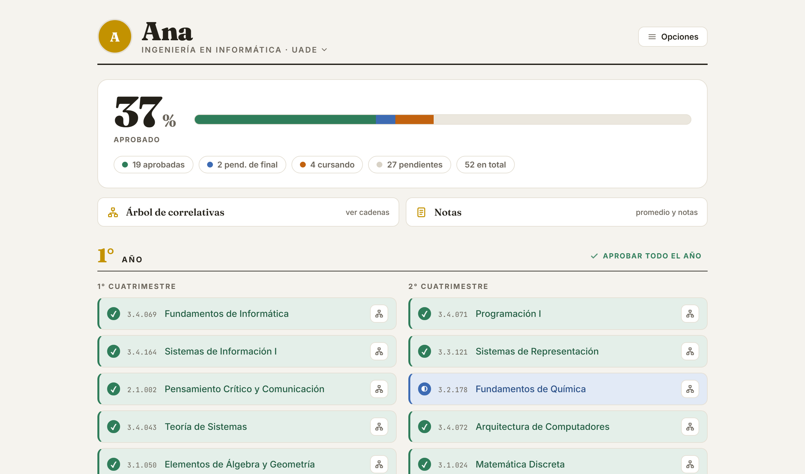
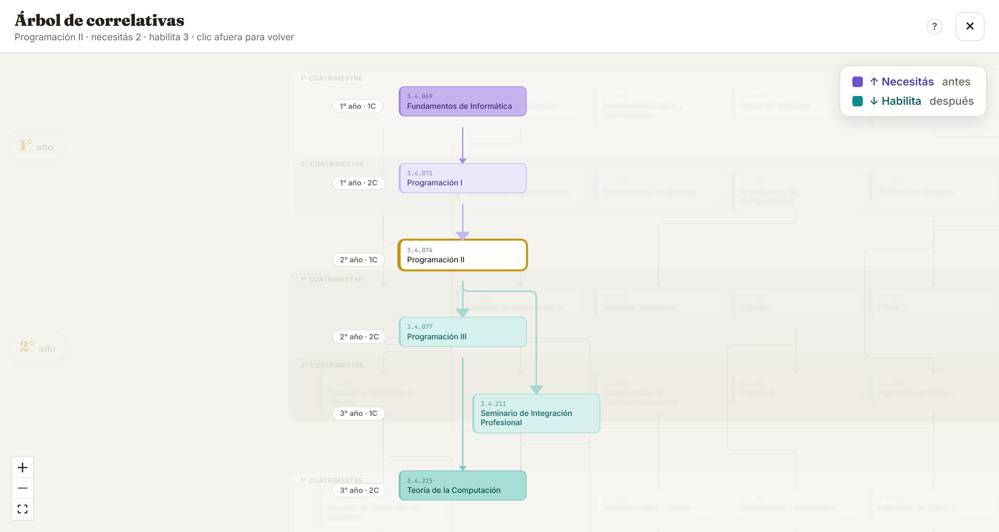

# 5 · Diseño visual y UX

## 5.1 Identidad

El nombre es la pregunta que todo estudiante se hace — **¿Cuánto me falta?** — y la aplicación entera está diseñada para responderla de un vistazo. La identidad visual acompaña esa idea con una estética de **papel y tinta**: fondo cálido, tarjetas blancas, tipografía serif expresiva para los títulos y un dorado institucional como color de marca. El tono de la interfaz es rioplatense e informal ("Marcá tus materias", "¿Cuánto me falta?"), porque le habla a estudiantes, de igual a igual.

## 5.2 Tipografías

| Fuente | Rol | Uso |
|---|---|---|
| **Fraunces** (serif) | Voz de la marca | Títulos, números grandes del tablero, hitos |
| **Inter** (sans) | Texto de trabajo | Cuerpo, listados, botones, formularios |
| **JetBrains Mono** (mono) | Datos técnicos | Códigos de materia (ej. `3.4.069`) |

Las tres se cargan desde Google Fonts con `display=swap` para no bloquear el renderizado.

## 5.3 Design tokens

Toda la paleta vive como variables CSS en `src/styles/global.css`, la única fuente de verdad del color: **83 tokens y cero colores literales** en el cuerpo del archivo (ADR-16). Ningún componente —tampoco los que dibujan el árbol desde TypeScript— escribe un color a mano.

**Base**

| Token | Valor | Uso |
|---|---|---|
| `--paper` | `#f5f3ee` | Fondo general (papel cálido); también `theme-color` de la PWA |
| `--card` | `#ffffff` | Tarjetas y superficies |
| `--ink` | `#232019` | Tinta: texto principal, bordes fuertes |
| `--soft` | `#6b655b` | Texto secundario |
| `--line` | `#e4dfd4` | Líneas y bordes suaves |
| `--gold` | `#c39200` | Color de marca: acentos, foco, hitos |

**Estados y relaciones** — cada concepto tiene una terna `color / fondo / texto` para usarse en chips, fondos y tipografía con contraste correcto:

| Concepto | Terna | Valores |
|---|---|---|
| Aprobada | `--ap` / `--ap-bg` / `--ap-tx` | `#2f7d5a` / `#e4efe9` / `#1e5a3f` |
| Cursando | `--cu` / `--cu-bg` / `--cu-tx` | `#c2620f` / `#f8e7d6` / `#8e450a` |
| Pendiente de final | `--fi` / `--fi-bg` / `--fi-tx` | `#3d6bb3` / `#e2eaf6` / `#284e86` |
| Necesitás (prerrequisito) | `--lk` / `--lk-bg` / `--lk-tx` | `#6b4fcf` / `#ece7fa` / `#4a35a0` |
| Habilita (dependiente) | `--hb` / `--hb-bg` / `--hb-tx` | `#0e8c8c` / `#dbf0ee` / `#0a5f5c` |

**Derivados** — el resto de los tokens son familias que antes vivían repetidas por el archivo: neutros de superficie (`--sunk`, `--line-fuerte`, `--card-hover`), la familia del dorado, el **rojo de peligro** (el único de la aplicación: no confundirlo con el naranja de *cursando*, que es un estado y no un problema), los avisos flotantes y los tintes suaves de cada sentido de correlativa. Tres detalles que la conversión a tokens dejó explícitos y conviene no volver a mezclar:

- **`--card` y `--sobre-color` no son el mismo blanco**, aunque hoy tengan el mismo valor: una es una **superficie** y la otra es **tinta sobre un fondo saturado**. El día que la superficie se oscurezca, la tinta no la sigue. Se distinguen por la propiedad en la que se usan (`background` vs. `color`).
- **Los `--*-rgb`** (`--gold-rgb`, `--ink-rgb`, …) existen porque `rgba()` no acepta un `var()` de color. Sin ellos, cada opacidad de un token se re-tipeaba a mano y cambiar el token no la alcanzaba.
- **Las dos rampas de cuatro pasos del árbol** (`--need-1..4-*` y `--unlock-1..4-*`) son tokens, no literales dentro del componente: más lejos de la materia enfocada, más oscuro.

## 5.4 El color como lenguaje

La decisión de diseño central: **el color codifica significado de manera consistente en toda la aplicación**. Verde siempre es aprobada; naranja, cursando; azul, pendiente de final; violeta, lo que una materia *necesita*; teal, lo que *habilita*. El mismo código rige en el listado del plan, en los paneles de correlativas, en el árbol, en el editor de la administración y en el resumen imprimible — una vez aprendido, se lee sin leyenda.

**La restricción que hereda cualquier paleta futura.** Como acá el color no decora sino que *codifica*, una paleta nueva no se juzga por si es linda: tiene que sostener **seis distinciones semánticas** (los cuatro estados de una materia, más *necesitás* y *habilita*) y **dos rampas de cuatro pasos** que se lean **ordenadas** y no se confundan entre sí. Dos cuidados concretos: verde y naranja son *aprobada* y *cursando* y se confunden con daltonismo, y el rojo está reservado para lo destructivo. Se verifica con **contraste calculado**, no a ojo.

## 5.5 La administración

La administración usa el mismo lenguaje visual, y esa continuidad es una decisión, no una economía: quien carga un plan ve **la grilla del estudiante, editable**, y marca las correlativas **sobre el mismo árbol** que después va a ver el alumno, con los mismos violeta y teal.

- **Se escribe sobre la fila, sin formularios.** Código, nombre, año y cuatrimestre se editan en la grilla; `Tab` pasa a la siguiente. Menos clics es literalmente el criterio de aceptación: cargar una carrera de ~40 materias en menos de dos horas.
- **Elegir la dirección antes de tocar.** Para conectar una correlativa se elige la materia y el sentido (*necesita* / *habilita*), y entonces la aplicación **ilumina lo conectable y apaga el resto**. Reusa el lenguaje de color que el usuario ya aprendió y hace imposible dibujar una flecha inválida.
- **Una franja de tres pasos** —*cargá las materias · marcá qué necesita cada una · revisá y publicá*— dice dónde se está y qué falta. El paso 2 **no muestra un porcentaje**: no existe un denominador honesto, porque las materias de primer año no tienen previas y están bien así.
- **El panel de cambios dice y la grilla muestra.** Antes de publicar se ve la lista de qué va a cambiar para los alumnos, redactada en castellano, con un signo por tipo y deshacer por cambio.
- **Los diálogos son propios, no del navegador.** Un `confirm()` nativo no puede mostrar **la lista** de qué se rompe ni pintar de rojo lo destructivo; los ocho que había se reemplazaron por confirmaciones con la estética de la app.
- **La acción va en el pie del panel.** El botón que grita *apretame* tiene que ser el que publica: cuando "Listo" era el primario y "Publicar" estaba a mitad del cuerpo, la posición de más peso visual no hacía nada.
- **Los mensajes hablan en nombres, no en códigos.** "Programación I (3.4.071) pide Fundamentos (3.4.069)": el nombre para leer, el código para encontrarla en la grilla.

## 5.6 Decisiones de interfaz

- **Selector de estado con lenguaje de estudiante.** Las opciones no son solo etiquetas: cada una se explica en primera persona ("La estoy cursando ahora", "Aprobé la cursada, me falta rendir"). Elimina ambigüedad sin manual.
- **Avisos que proponen el paso siguiente.** El aviso de correlativas no es un error: dice exactamente qué falta y ofrece un botón para ver el árbol con foco en esa materia. Informar + accionar en el mismo gesto.
- **Paneles de correlativas múltiples.** Se pueden abrir varios a la vez para comparar materias — la consulta real nunca es de a una.
- **El tablero responde la pregunta del título.** Porcentaje grande, hitos de título con cuántas materias faltan y avance por año: la respuesta a "¿cuánto me falta?" está arriba de todo, siempre.
- **Onboarding guiado que termina en acción.** Tour de coach marks en la primera visita, repetible a demanda desde Opciones; nunca vuelve a interrumpir solo. El paso de cierre no explica: invita a marcar la primera materia y abre ahí mismo el selector de estado — el tutorial desemboca en la acción que arranca el uso (activación), no en una despedida.
- **Dos tutoriales cortos, no uno largo.** La administración reusa el mismo recorrido de coach marks del estudiante, pero partido en dos —la lista (3 pasos) y el editor (4)— cada uno con su marca de visto y en el momento en que hace falta. El del editor explica **solo lo que la franja de tres pasos no dice**: que se escribe inline, que las correlativas se marcan sobre el árbol y dónde se revisa antes de publicar. Un tutorial en contexto es lo que permite que el manual sea corto.
- **Acciones peligrosas, visualmente peligrosas.** Reiniciar el progreso está separado, marcado en rojo y pide confirmación.
- **Resumen pensado para papel.** La vista de impresión no es la pantalla "como salga": es un documento propio, diseñado con `@media print`, con identidad, métricas y materias por estado.

## 5.7 Responsive y accesibilidad

- Diseño mobile-first: el uso típico es en el teléfono, entre clases. En pantallas angostas el encabezado se compacta (los botones conservan solo el ícono) para priorizar el nombre y la carrera.
- Contenedor de lectura acotado (`max-width: 980px`) para líneas cómodas en escritorio.
- Menús con roles ARIA (`role="menuitem"`), cierre con `Escape` en superficies modales (árbol) y foco visible con el dorado de marca.
- Las ternas de color de estado incluyen una variante de texto oscurecida (`-tx`) para asegurar contraste sobre los fondos suaves.

## 5.8 Extensión de la identidad

La identidad visual trasciende la app: el formulario de feedback (Tally) está personalizado con `--paper`, `--ink` y `--gold`, y esta misma documentación en PDF usa la paleta y las tipografías del producto. Una sola voz visual en todos los puntos de contacto.
