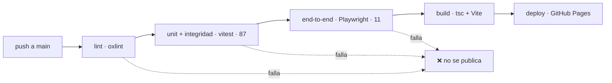

# 6 · Calidad y despliegue

## 6.1 Estrategia

La aplicación maneja el dato más sensible de un estudiante — su avance real en la carrera — sobre un grafo académico cargado a mano. Los dos riesgos principales son: **romper las reglas de dominio** (métricas o correlativas mal calculadas) y **cargar mal los datos académicos** (una correlativa que apunta a una materia inexistente, un ciclo imposible de cursar). La estrategia ataca cada riesgo en su nivel:

| Nivel | Herramienta | Qué protege | Cantidad |
|---|---|---|---|
| Unitario | Vitest | Las reglas de dominio (`Plan`, `Store`, `selectors`) y la lógica de sincronización (`sync`) | 61 tests |
| Integridad de datos | Vitest | El grafo académico de **cada plan** cargado | 26 tests |
| End-to-end | Playwright (Chromium) | Los flujos reales del usuario en el navegador | 11 escenarios |
| Estático | TypeScript estricto + oxlint | Tipos y errores de código antes de ejecutar | — |

En total, **98 tests automatizados** que corren en cada push. Ninguna versión se publica si alguno falla.

## 6.2 Tests unitarios (61)

Gracias a que el dominio y la lógica de sync son TypeScript puro (ADR-03), se testean sin navegador y en milisegundos:

- **`Plan` (11):** construcción del plan por año/cuatrimestre, correlativas directas (`antes`/`después`), cadenas recursivas completas (`chainUp`/`chainDown`) y niveles BFS para el árbol.
- **`Store` (12):** mutaciones inmutables, persistencia y recuperación, valores por defecto, límites de nota (1–10, redondeo), nombres de optativas (recorte a 48 caracteres, vaciado) y suscripciones.
- **`selectors` (25):** avance y porcentaje, promedio (solo aprobadas con nota; sin notas no rompe), previas faltantes por estado destino (la regla cursar vs. aprobar), disponibilidad, hitos de título por año e iniciales del avatar.
- **`sync` (13):** conteos de progreso, la decisión de merge al iniciar sesión (subir / bajar / nada / conflicto — el perfil no cuenta como diferencia), snapshot y escritura local de todas las carreras (ida y vuelta sin pérdida) y el registro de consentimiento que viaja con los datos.

## 6.3 Tests de integridad de datos académicos (26)

Los planes se cargan a mano; estos tests convierten cada error de carga en un build rojo. Dos verificaciones cubren el registro completo (los ids de plan son únicos; el plan por defecto existe) y, además, las ocho siguientes se ejecutan **para cada uno de los tres planes** (8 × 3 = 24):

1. No hay códigos de materia duplicados.
2. Ninguna materia tiene código o nombre vacío.
3. Cada correlativa apunta a materias que existen en el plan.
4. Ninguna materia es correlativa de sí misma.
5. No hay correlativas duplicadas.
6. **El grafo de correlativas no tiene ciclos** (un ciclo haría la carrera imposible de cursar).
7. Los títulos apuntan a años que existen en el plan.
8. Ninguna optativa participa de las correlativas (invariante de RN-05: las optativas se habilitan por la oferta anual, no por correlativas).

Agregar una carrera nueva es agregar datos — y estos tests la validan automáticamente sin escribir un test más: el archivo recorre el registro completo de planes.

## 6.4 Tests end-to-end (11)

Playwright ejercita la aplicación real en Chromium, como un usuario:

1. La app carga y muestra el tablero de avance.
2. Marcar una materia como aprobada actualiza el avance.
3. Marcar una materia sin las previas dispara el aviso de correlativas.
4. El botón del aviso abre el árbol de correlativas.
5. El árbol se abre desde el tablero y se cierra con `Escape`.
6. El panel de Notas abre, muestra el promedio y cierra.
7. Cargar una nota actualiza el promedio.
8. La bienvenida de primera visita pide el nombre y entra a la app.
9. Elegir otra carrera en la bienvenida carga ese plan.
10. El resumen en PDF usa la carrera del plan activo (no una fija).
11. El tutorial corre en la primera visita y no vuelve a aparecer.

Cubren de punta a punta los flujos principales: primer ingreso y elección de carrera (CU-01), estados y aviso de correlativas (CU-03), notas y promedio (CU-04), árbol de correlativas (CU-06), resumen en PDF (CU-11) y tutorial (CU-12).

## 6.5 Pipeline de CI/CD

Cada push a `main` dispara el pipeline en GitHub Actions. El **gate de calidad** es estricto: si el lint, los tests unitarios o los end-to-end fallan, no se construye ni se publica nada.

Detalles del pipeline (`.github/workflows/deploy.yml`):

- Node 20 con caché de dependencias (`npm ci` reproducible).
- Playwright instala Chromium dentro del runner para los e2e.
- El build corre `tsc -b` (chequeo completo de tipos) antes de Vite.
- El artefacto `dist/` se publica en GitHub Pages mediante el flujo oficial de Actions, con concurrencia controlada (un deploy a la vez).

## 6.6 Publicación

- **Hosting:** GitHub Pages (sitio estático, sin servidores propios).
- **Dominio propio:** [cuantomefalta.app](https://cuantomefalta.app), configurado vía `CNAME`.
- **PWA:** manifest, service worker e íconos publicados junto a la app; los usuarios instalados reciben las versiones nuevas al recargar.
- **Entornos:** la analítica se activa solo por variables de entorno de producción y se desactiva sola en `localhost`, así el desarrollo no ensucia métricas (§4.9).
