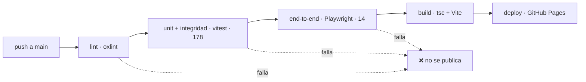

# 6 · Calidad y despliegue

## 6.1 Estrategia

La aplicación maneja el dato más sensible de un estudiante — su avance real en la carrera — sobre un grafo académico cargado a mano. Los dos riesgos principales son: **romper las reglas de dominio** (métricas o correlativas mal calculadas) y **cargar mal los datos académicos** (una correlativa que apunta a una materia inexistente, un ciclo imposible de cursar). La estrategia ataca cada riesgo en su nivel:

| Nivel | Herramienta | Qué protege | Cantidad |
|---|---|---|---|
| Unitario | Vitest | Las reglas de dominio (`Plan`, `Store`, `selectors`) y la lógica de sincronización (`sync`), de materias compartidas (`espejo`), el layout del árbol (`arbolLayout`), la medición de retención (`analytics`), la **validación de planes** (`validarPlan`) y el **registro de datos académicos** (`registro`) | 168 tests |
| Integridad de datos | Vitest | Que los planes **reales** del repo pasen el validador sin errores | 10 tests |
| End-to-end | Playwright (Chromium) | Los flujos reales del usuario en el navegador | 14 escenarios |
| Estático | TypeScript estricto + oxlint | Tipos y errores de código antes de ejecutar | — |

En total, **192 tests automatizados** que corren en cada push. Ninguna versión se publica si alguno falla.

## 6.2 Tests unitarios (168)

Gracias a que el dominio y la lógica de sync son TypeScript puro (ADR-03), se testean sin navegador y en milisegundos:

- **`Plan` (15):** construcción del plan por año/cuatrimestre, correlativas directas (`antes`/`después`), cadenas recursivas completas (`chainUp`/`chainDown`), niveles BFS para el árbol, y títulos con corte por cuatrimestre (`hastaCuatri`: dónde cuelga el hito y qué materias exige vía `materiasHasta`).
- **`Store` (18):** mutaciones inmutables, persistencia y recuperación, valores por defecto, límites de nota (1–10, redondeo), nombres de optativas (recorte a 48 caracteres, vaciado), suscripciones, el **marcado en bloque** con su inverso exacto (RN-15: deshacer el interruptor de año devuelve cada materia a como estaba — las que no tenían marca quedan sin marca — y las notas no se tocan), y el **espejo de otras carreras** (RN-13: la materia compartida se ve con el avance heredado, la marca propia gana, y el espejo no se persiste ni se exporta).
- **`selectors` (28):** avance y porcentaje, promedio (solo aprobadas con nota; sin notas no rompe), previas faltantes por estado destino (la regla cursar vs. aprobar), disponibilidad, el **interruptor de año** (RN-15: aprueba mientras falte algo, deja en blanco cuando el año está completo, y las optativas nunca entran), hitos de título e iniciales del avatar.
- **`sync` (32):** conteos de progreso (las materias custom también cuentan), la decisión de merge al iniciar sesión (subir / bajar / nada / conflicto — el perfil no cuenta como diferencia), la **base de última sincronización** (RN-12: un dispositivo ya sincronizado baja o sube solo según quién avanzó; la huella es canónica — el orden de inserción no inventa diferencias), la **fusión de a tres** cuando avanzaron los dos lados (`merge3`: cambios en materias distintas se combinan sin perder nada; un borrado no resucita; la pregunta queda solo para la misma materia tocada distinto en ambos lados), la marca de **cambios sin subir** (si el usuario edita o borra y refresca antes del push, lo local es más nuevo y no se pisa con un pull), snapshot y escritura local de todas las carreras (ida y vuelta sin pérdida) y el registro de consentimiento que viaja con los datos.
- **`espejo` (6):** materias compartidas entre carreras (RN-13): qué se hereda y qué no (optativas y otras universidades quedan afuera), entre varias carreras gana el estado más avanzado, y la nota acompaña al estado ganador.
- **`arbolLayout` (24):** el motor de layout del árbol (ADR-10) corre el layout REAL y verifica los **invariantes geométricos** por plan: la malla es una grilla exacta y sus correlativas **cortas** salen ruteadas sin cruzar ninguna tarjeta (RN-14: columnas en slots, filas en orden temporal, y se dibujan todas las de uno o dos cuatrimestres — ni una más ni una menos) y la rama de **cada materia con cadena** (~150 subgrafos ELK) sale sin aristas que crucen tarjetas, sin verticales de distinto origen pegadas y con todo fluyendo hacia abajo. Verifican además la **reducción transitiva**: que sacar las correlativas deducibles no cambie lo que se alcanza desde ninguna materia, y que después de sacarlas ninguna rama tenga una flecha que salte del "necesitás" al "habilita" — el caso que dejaba un tronco compartido pintado de dos colores. "El árbol quedó mal" es un build rojo, también para planes futuros.
- **`validarPlan` (21):** el validador de planes de estudio (ADR-11), probado con planes **roto a propósito**: cada regla se ve fallar (cabecera incompleta, materia sin nombre o con cuatrimestre inválido, código repetido, correlativa a una materia inexistente, materia correlativa de sí misma, correlativa repetida, correlativa que no está en un cuatrimestre anterior, círculo de correlativas, optativa metida en el grafo, título hasta un año o cuatrimestre que el plan no tiene) y cada aviso se ve **no** bloquear la publicación (plan sin títulos, nombres repetidos, año salteado). Es la mitad que faltaba: hasta ahora los invariantes solo se ejercitaban contra datos que los cumplían, así que no había forma de saber si el chequeo medía algo.
- **`registro` (19):** de dónde salen los planes al arrancar (ADR-11): sin caché manda el bundle; con caché válido manda el caché (y puede traer más planes que el bundle); un plan cacheado que no valida se descarta y, si no queda ninguno, se vuelve al bundle; un caché de versión vieja o ilegible se ignora; sin `localStorage` nada explota. Más la conversión del dato de red (`filaAPlan`: no inventa claves — `opt`/`especial` viajan solo cuando son `true` — y rechaza filas con tipos raros) y la comparación estable, que ignora el orden de las **claves** (el bundle TS y el JSON del backend las traen distinto) pero respeta el de los **arrays** (en un plan, el orden de las materias es dato: es cómo se dibuja).
- **`analytics` (5):** la decisión de la medición de retención (`decidirSesion`) para una app "de mirar", donde el valor es volver aunque no se edite nada: el día activo se cuenta una vez por jornada, y el `regreso` (volver otro día habiendo armado el plan) una sola vez en la vida — quien nunca marcó una materia no cuenta como regreso.

## 6.3 Tests de integridad de datos académicos (10)

Los planes se cargan a mano; estos tests convierten cada error de carga en un build rojo. Las **reglas** viven en `src/lib/validarPlan.ts` (ADR-11) porque las comparten tres lugares: el CI, el editor de planes (un plan con errores no se puede publicar) y el arranque de la app (un plan que llega del backend roto se descarta antes de dibujarse). Que cada regla salte cuando corresponde se prueba en `validarPlan.test.ts` con planes roto a propósito; acá se verifica lo otro: que **los planes reales del repo estén limpios**.

Dos verificaciones cubren el registro completo (los ids de plan son únicos; el plan por defecto existe) y, para cada uno de los cuatro planes (2 × 4 = 8):

1. **`validarPlan` no reporta ningún error** — cubre de una las trece reglas: sin códigos duplicados, sin materias vacías o con cuatrimestre inválido, cada correlativa apunta a materias que existen, ninguna es correlativa de sí misma, sin correlativas duplicadas, **sin ciclos** (un ciclo haría la carrera imposible de cursar), **toda correlativa a un cuatrimestre anterior** (invariante del árbol: una fila por cuatrimestre → toda flecha fluye hacia abajo), ninguna optativa en el grafo (RN-05), y títulos que apuntan a años y cuatrimestres existentes. Cuando falla, el mensaje dice qué regla y en qué materias.
2. **Ningún aviso inesperado** — los avisos no bloquean, pero uno nuevo (fuera de "nombres repetidos", "sin títulos" y "año salteado") significa que un dato cambió y hay que decidir si está bien.

Agregar una carrera nueva es agregar datos — y estos tests la validan automáticamente sin escribir un test más: el archivo recorre el registro completo de planes.

## 6.4 Tests end-to-end (14)

Playwright ejercita la aplicación real en Chromium, como un usuario:

1. La app carga y muestra el tablero de avance.
2. Marcar una materia como aprobada actualiza el avance.
3. Marcar una materia sin las previas dispara el aviso de correlativas.
4. El botón del aviso abre el árbol de correlativas.
5. El árbol se abre desde el tablero y se cierra con `Escape`.
6. El panel de Notas abre, muestra el promedio y cierra.
7. Cargar una nota actualiza el promedio.
8. La bienvenida de primera visita pide el nombre y entra a la app.
9. Elegir otra carrera en la bienvenida carga ese plan.
10. Una materia aprobada en una carrera figura aprobada en la otra que la comparte (y sin duplicar datos).
11. El resumen en PDF usa la carrera del plan activo (no una fija).
12. El tutorial corre en la primera visita y no vuelve a aparecer.
13. El interruptor de año aprueba el año entero y se puede deshacer (RN-15).
14. **Un plan bajado del backend reemplaza al del bundle** (ADR-11): con un plan en el caché, la app entera se dibuja con ese plan; y si ese mismo caché queda roto (una correlativa a una materia que no existe), se descarta y vuelve el plan del bundle.

Cubren de punta a punta los flujos principales: primer ingreso y elección de carrera (CU-01), estados y aviso de correlativas (CU-03), notas y promedio (CU-04), árbol de correlativas (CU-06), materias compartidas entre carreras (RN-13), resumen en PDF (CU-11), tutorial (CU-12), marcado por año (RN-15) y el origen de los datos académicos (ADR-11).

## 6.5 Pipeline de CI/CD

Cada push a `main` dispara el pipeline en GitHub Actions. El **gate de calidad** es estricto: si el lint, los tests unitarios o los end-to-end fallan, no se construye ni se publica nada.

```mermaid
%% svg:pipeline
flowchart LR
    P["push a main"] --> L["lint · oxlint"]
    L --> U["unit + integridad · vitest · 178"]
    U --> E["end-to-end · Playwright · 14"]
    E --> B["build · tsc + Vite"]
    B --> D["deploy · GitHub Pages"]
    L -. falla .-> X["❌ no se publica"]
    U -. falla .-> X
    E -. falla .-> X
```

Detalles del pipeline (`.github/workflows/deploy.yml`):

- Node 20 con caché de dependencias (`npm ci` reproducible).
- Playwright instala Chromium dentro del runner para los e2e.
- El build corre `tsc -b` (chequeo completo de tipos) antes de Vite.
- El artefacto `dist/` se publica en GitHub Pages mediante el flujo oficial de Actions, con concurrencia controlada (un deploy a la vez).

## 6.6 Publicación

- **Hosting:** GitHub Pages (sitio estático, sin servidores propios).
- **Dominio propio:** [cuantomefalta.app](https://cuantomefalta.app), configurado vía `CNAME`.
- **PWA:** manifest, service worker e íconos publicados junto a la app; los usuarios instalados reciben las versiones nuevas al recargar.
- **Entornos:** la analítica se activa solo por variables de entorno de producción y se desactiva sola en `localhost`, así el desarrollo no ensucia métricas (§4.9).
